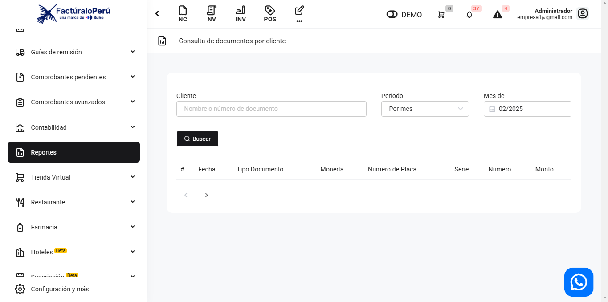
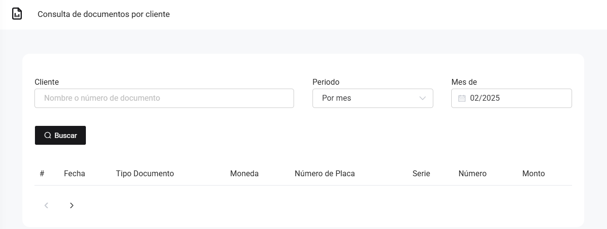

# Venta: Clientes

En este artículo te mostraremos como revisar los reportes por el filtro de clientes. Sigue estos pasos para realizarlo:

Ingresa al módulo de **Reportes** y luego en la subcategoría **Ventas**, selecciona **Clientes.**

Aparecerá lo siguiente:

:::danger IMPORTANTE:
Selecciona solo los filtros que requiera.
:::

Completa los siguientes filtros:

Podrá exportar los reportes, seleccionando el botón correspondiente.

Luego seleccione el botón **Buscar**. Se observan los comprobantes realizados al cliente que selecciono:

