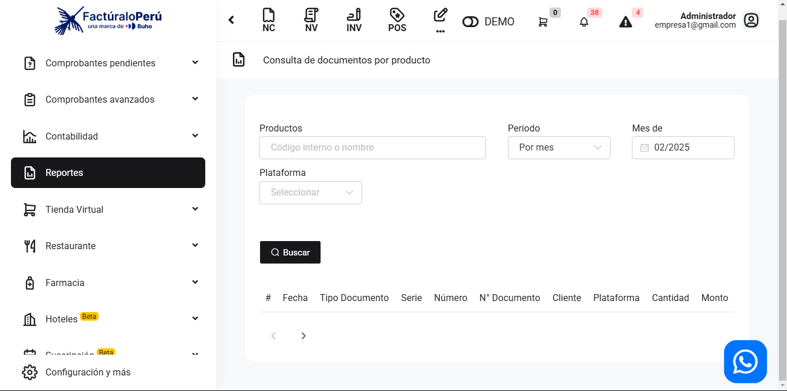

# Ventas: Producto - Búsqueda Individual

En este artículo te te mostraremos como revisar los reportes por el filtro de productos de manera individual. Es un reporte sencillo, cuando seleccionas el producto especifico con periodo de fecha, mostrará el total de la factura .Sigue estos pasos para realizarlo:

Ingresa al módulo de **Reportes** y luego en la subcategoría **Ventas**, selecciona **Producto - Búsqueda Individual.**

Aparecerá lo siguiente:

Completa los siguientes filtros:

:::danger IMPORTANTE:
No es necesario completar todos los campos.

:::

Podrá exportar los reportes, seleccionando el botón correspondiente.

Luego seleccione el botón **Buscar**. Se observan los comprobantes realizados con el producto que seleccionó:

