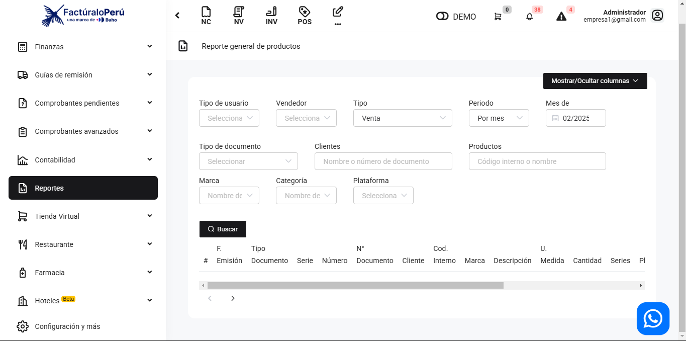
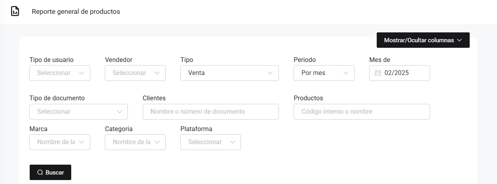
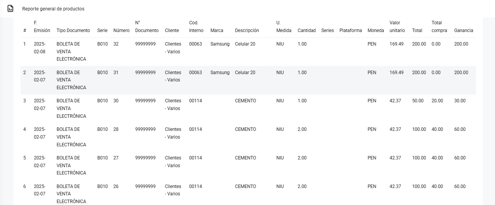

# Ventas: Producto

En este artículo te mostraremos como revisar los reportes por el filtro de productos. Un reporte más detallado de los productos: Observará todas las facturas con el producto, el valor unitario, la compra y la ganancia.

Sigue estos pasos para realizarlo:

Ingresa al módulo de **Reportes** y luego en la subcategoría **Ventas**, selecciona **Productos**.

Aparecerá lo siguiente:

Completa los siguientes filtros:

:::danger IMPORTANTE:
Selecciona solo los filtros que requiera.
Podrá exportar los reportes, seleccionando el botón correspondiente.
:::

Luego seleccione el botón **Buscar**. Se observan los comprobantes realizados con el producto que selecciono, por cada producto aparecerá una diferente linea detallada a pesar que se encuentren en el mismo comprobante electrónico:

