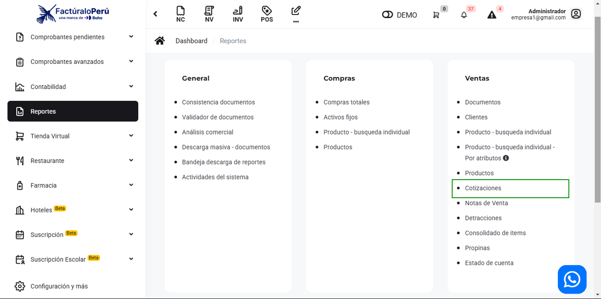
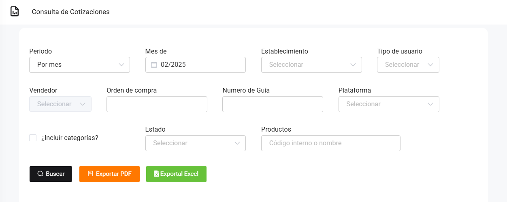

# Ventas: Cotizaciones

En este artículo te mostraremos como revisar los reportes de cotizaciones, podrá observar sus cotizaciones tengan o no pago. Sigue estos pasos para realizarlo:

Ingresa al módulo de **Reportes** y luego en la subcategoría **Ventas**, selecciona **Cotizaciones**.

Aparecerá lo siguiente:

Completa los siguientes filtros:

:::danger IMPORTANTE:

Selecciona solo los filtros que requiera.
:::

Podrá exportar los reportes, seleccionando el botón correspondiente.

Luego seleccione el botón **Buscar**. Se observarán las cotizaciones realizadas, también podrá observar si la cotización esta anexada a alguna factura o nota de venta.

