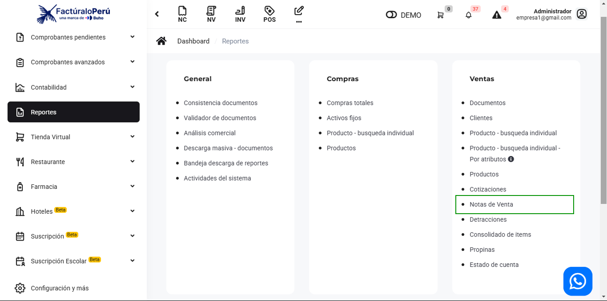
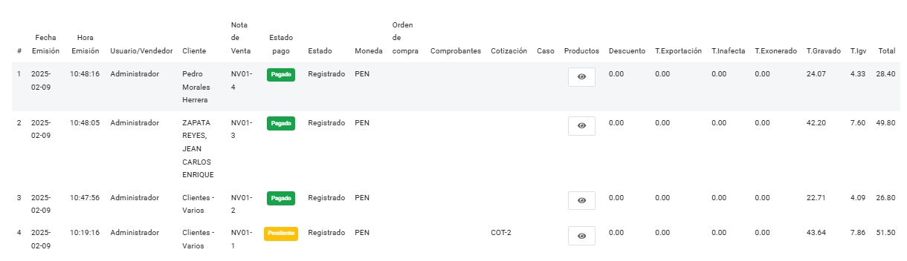

# Ventas: Notas de ventas

En este artículo te mostraremos como revisar los reportes de notas de ventas. Sigue estos pasos para realizarlo:

Ingresa al módulo de **Reportes** y luego en la subcategoría **Ventas**, selecciona **Notas de ventas.**

Aparecerá lo siguiente:

Completa los siguientes filtros:

:::danger IMPORTANTE:

Selecciona solo los filtros que requiera.

:::
Podrá exportar los reportes, seleccionando el botón correspondiente.

Luego seleccione el botón **Buscar.** Se observaran las notas de venta realizadas.

