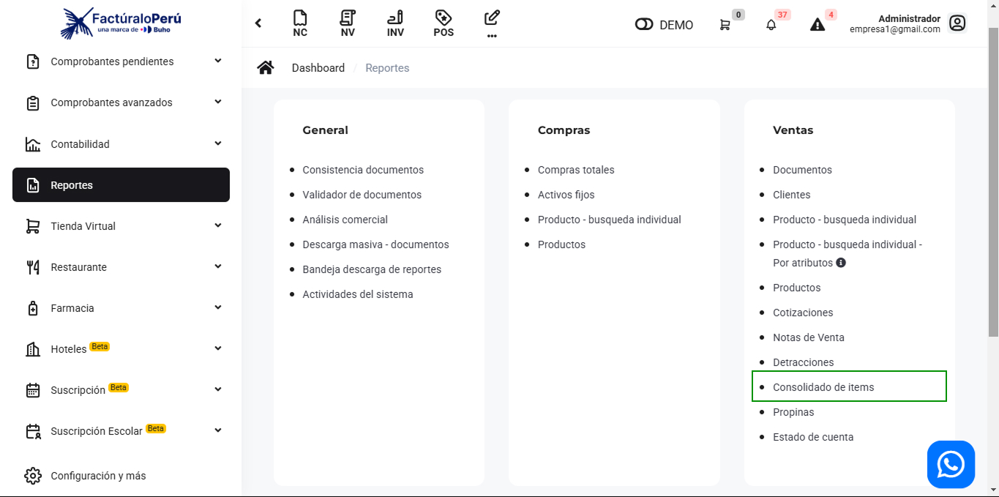
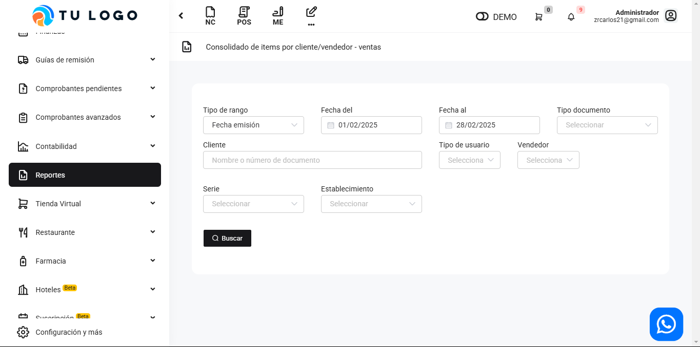
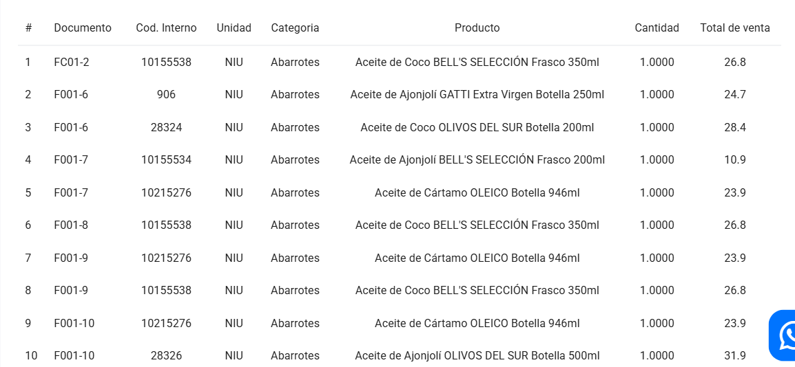

# Ventas: Consolidado de ítem

En este artículo te ayudaremos a visualizar el consolidado de ítems de los productos: incluye código interno del producto, la unidad, producto,categoría y el total de venta de acuerdo al periodo que haya seleccionado. Sigue estos pasos para realizarlo:

Ingresa al módulo de **Reportes** y luego en la subcategoría **Ventas**, selecciona **Consolidado de Items.**

Aparecerá lo siguiente:

Completa los siguientes filtros:

:::danger IMPORTANTE:
Selecciona solo los filtros que requiera.
:::

Podrá exportar los reportes, seleccionando el botón correspondiente.

Luego seleccione el botón **Buscar.** Se observa el código interno del producto, la unidad, categoría, el producto y el total de venta:

