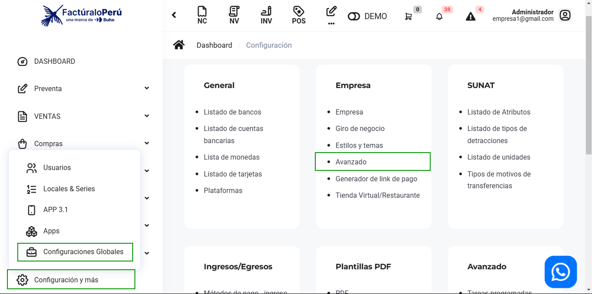
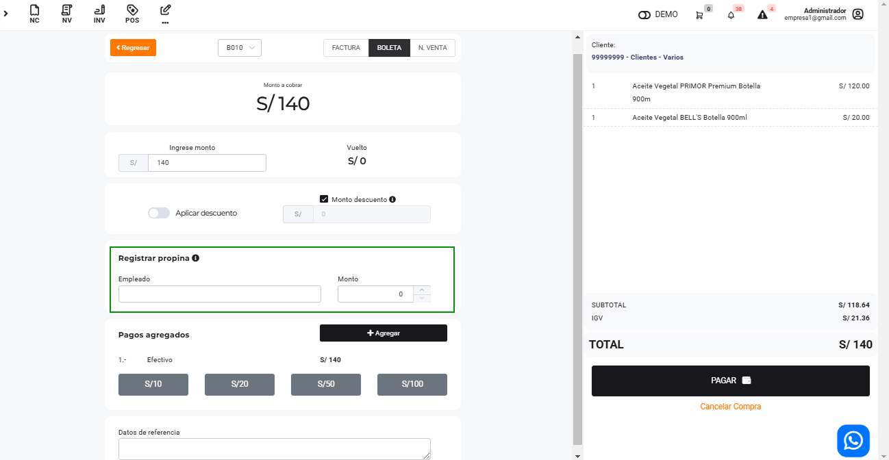
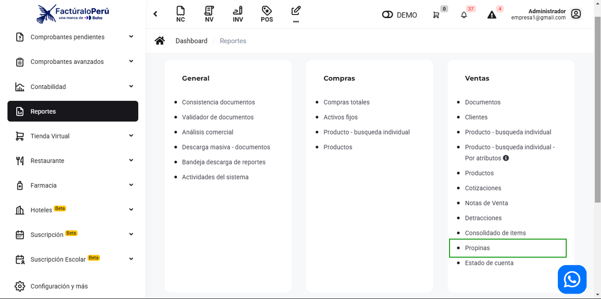
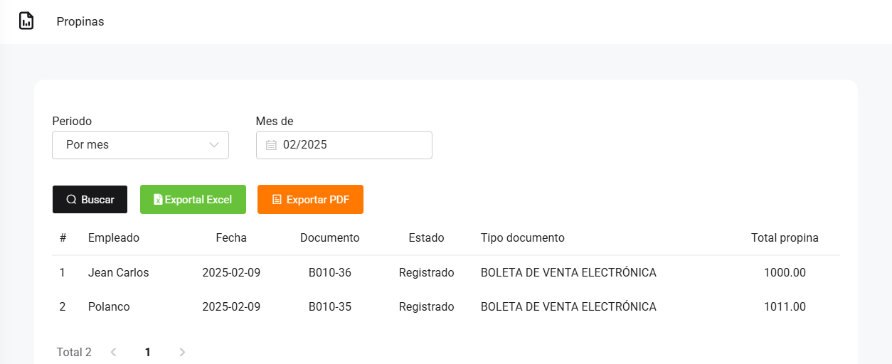

# Ventas: Propinas

En este artículo te ayudaremos a generar un reporte de propinas. Sigue estos pasos para realizarlo:

## Configuración previa

Para que en los comprobantes electrónicos aparezca el campo para agregar el monto de propina. Ingresa al módulo de **Configuración** y luego en la subcategoría **Empresa**, selecciona **Avanzado.**

Seguido, tendrá que activar la siguiente opción:

## Registrar el monto de la propina

Para registrar la propina, ingresa al módulo de **Venta** y luego selecciona en la subcategoría **Punto de venta.**

Selecciona los productos, seguido en la parte lateral. Completa:

* **Empleado:** Ingresa el nombre que esta realizando la venta.
* **Monto:** Ingresa el monto de la propina.
  
Seguido termina de completar el comprobante electrónico.

## Reporte propinas

Para poder visualizar el registro de propinas, ingresa al módulo de **Reportes** y luego en la subcategoría **Ventas**, selecciona **Propinas.**

Seguido, completa:

* **Periodo**
* **Mes**
Seguido selecciona el botón **Buscar.**

Aparecerá un detallado de las propinas recibidas.

Podrá exportar el reporte a Excel, **PDF** con el botón correspondiente.
