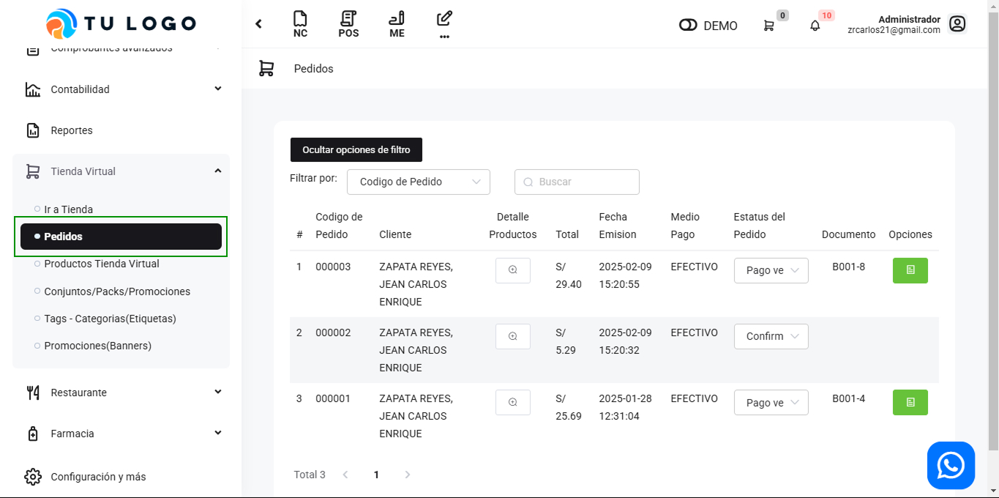
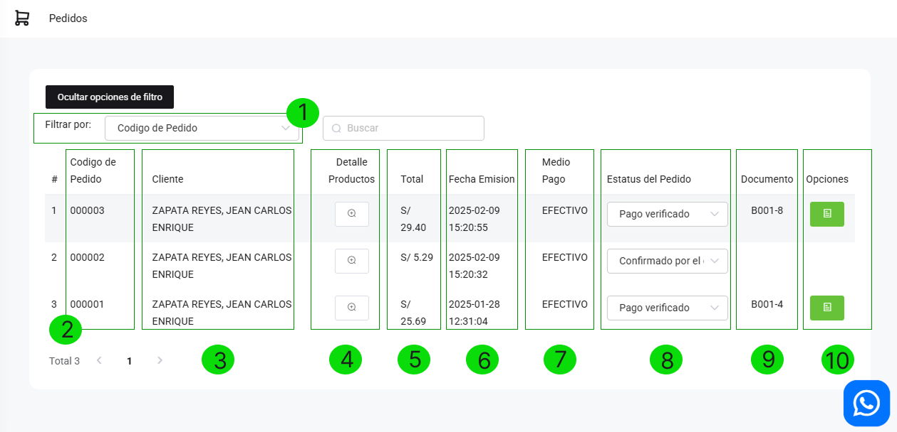

# Gestionar Pedidos

En esta área conocerás cómo gestionar el listado de pedidos realizados en tu Tienda virtual:

Ingresa al módulo **Tienda Virtual**, en la subcategoría **Pedidos**.

LISTADO DE PEDIDOS
Se visualizarán diferentes funcionalidades de las secciones enumeradas:

**1. Filtrar por:** En esta sección encontrará el pedido de una forma más rápida y puede filtrar la búsqueda con el código del pedido o comprobante electrónico.

**2. Código de pedido:** Es el conjunto de números únicos para cada compra.

**3. Clientes:** Lista de nombre de los titulares de la compra.

**4. Detalle de productos:** Permite visualizar el detalle de lo comprado, así como también la dirección y el número de contacto.

**5. Total:** Es el precio total del pedido.

**6. Fecha Emisión:** Es la fecha en la que se expide la  orden de compra.

**7. Medio de Pago:** Método de pago que el cliente seleccionó para realizar la compra.

**8. Estatus de pedido:** Son todas las fases por las que pasa un pedido,puede seleccionar las siguientes opciones:

- Pago sin verificar: Pago pendiente de verificación.
- Pago verificado: Cuando el pago ha sido recibido.
- Despachado: Cuando el pedido ya salió del almacen y está en curso.
- Confirmado por el cliente: Cuando el cliente recibió el pedido.

**9. Documento:** Es el tipo de comprobante que escogió el cliente.

**10. Opciones:** Permite imprimir el comprobante en formato **ticket /A4 /A5**, asimismo  puedes enviarlo por correo electrónico o WhatsApp, ingresando el dato del destinatario y seleccionando el botón Enviar.
