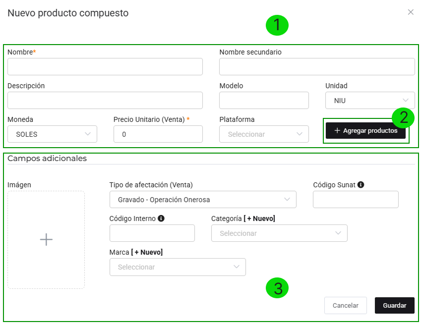
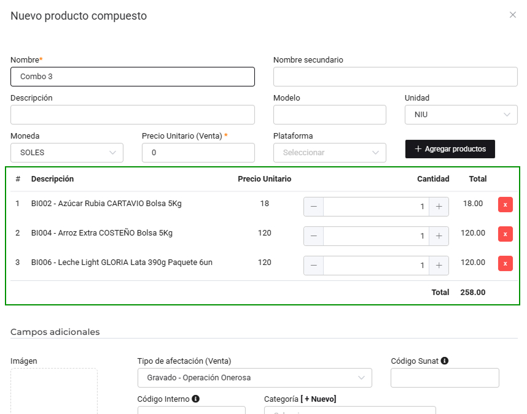

# Armar packs y promociones

En esta área te ayudaremos a crear paquetes/promociones para hacer más atractiva la forma de venta en tu tienda virtual.

Sigue estos pasos para realizarlo:

Ingresa al **módulo Tienda Virtual**, en la subcategoría **Conjuntos/Packs/Promociones**.

En la parte superior derecha selecciona el botón **Nuevo**.

Al seleccionar el botón **Nuevo**, se encontrará el formulario del nuevo producto compuesto.

**1. Datos del producto compuesto**
Se procederá a ingresar los siguientes datos:

- **Nombre:** Es el nombre del paquete promocional.
- **Descripción:** Agrega una breve descripción sobre el paquete.
- **Moneda:** Selecciona el tipo de moneda en dólares americanos o Soles
- **Precio Unitario:** Es el valor monetario de su producto.
- **Unidad:** Son las unidades de medidas, selecciona la que se acomode a su negocio.

**2. Agregar Producto:**

Posteriormente selecciona el botón **Agregar producto** y se mostrará el siguiente formulario.

Se procederá a ingresar los siguientes datos:

- **Producto:** Selecciona todos los productos creados previamente, que conformarán el paquete promocional,si los productos no estan creados,podrá realizarlo paso a paso,en este **[artículo](https://manual.uio.la/Pro7/modulos/Esenciales/productos-servicios/Productos-Creacion-basica)**.
- **Cantidad:** Ingresa la cantidad de los productos.

**3. Campos adicionales:**

Se procederá a ingresar los siguientes datos:

- **Imagen:** Selecciona la imagen de su paquete promocional.
- **Tipo de afectación(Venta):** Dejarlo por defecto en Gravado - Operación Onerosa, si desea seleccionar otra opción, consulte con su contador.
- **Código interno:** Es indispensable para tener una mejor organización y control de su productos.
- **Categoría:** Selecciona la categoría que pertenezca su paquete promocional.
- **Marca:** Selecciona la marca que pertenezca a su paquete promocional.

Después selecciona el botón **Guardar**, donde visualizará la lista de los productos compuestos.

