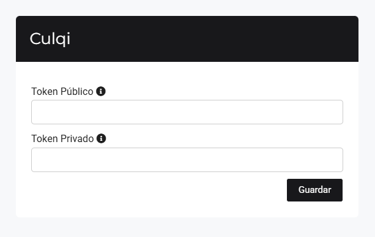
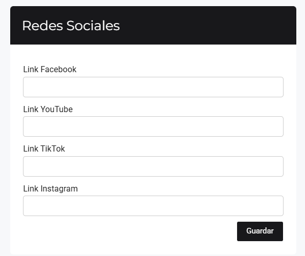
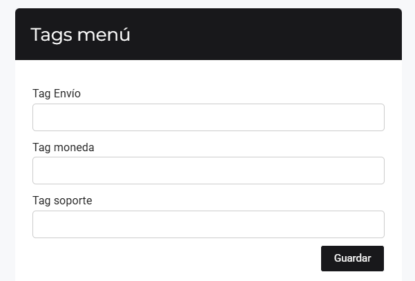
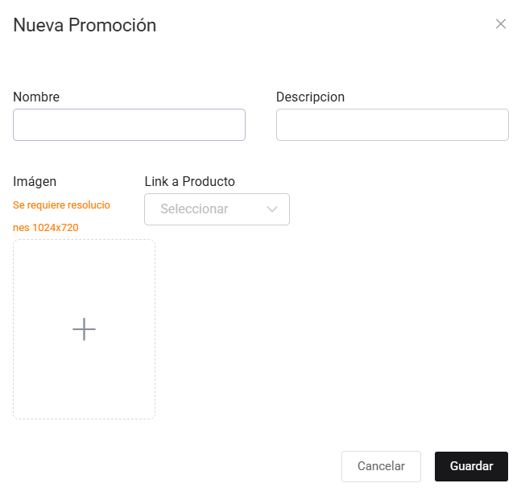
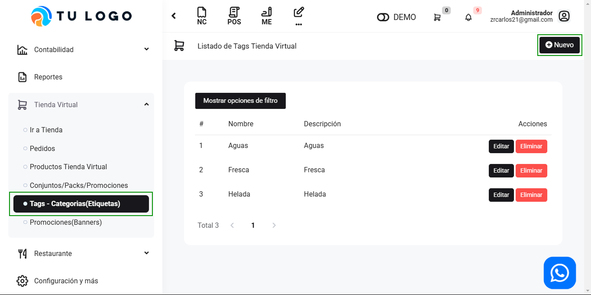
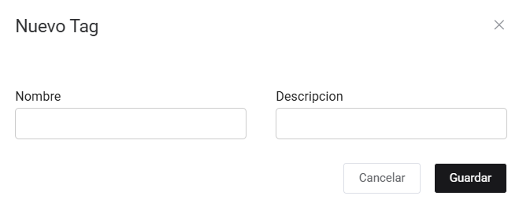
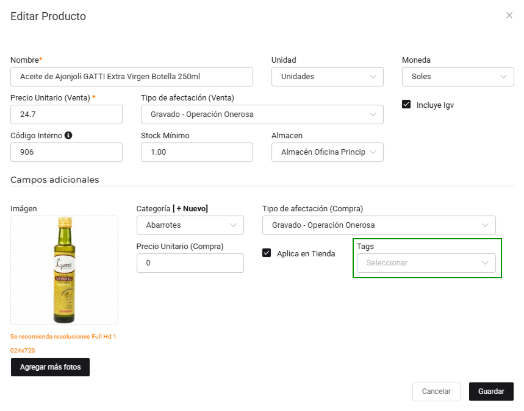

# Configurar mi tienda virtual

En esta área te ayudaremos a configurar la información principal, banners y tags de los productos.

Sigue estos pasos para realizarlo:

## Configuración

Ingresa al módulo de **Configuracion y mas** y luego selecciona la subcategoría **Configuraciones Globales**. Ubicara la seccion de **Empresa** y seleccione la opcion de **Tienda Virtual/Restaurante**

En esta sección podrá configurar toda la parte visual y los pagos.

## 1. Información de contacto

Completa los campos requeridos con la información del establecimiento, y así el cliente podrá contactarse.

Luego selecciona el botón **Guardar**.

## 2. Culqi

Para integrar la pasarela de pagos Culqi, es necesario colocar el usuario y contraseña.

Luego selecciona el botón **Guardar**.

## 3. Paypal

Para integrar Paypal, es necesario colocar el código Html Formulario Paypal para que los clientes realicen los pagos respectivos con esta pasarela de pagos.

Luego selecciona el botón **Guardar**.

## 4. Logo

Podrá colocar el logo de su empresa y se visualizará en la Tienda virtual, luego seleccione el botón **Guardar**.

## 5. Redes sociales

Ingrese el enlace de las redes sociales de su empresa. Luego selecciona el botón **Guardar**.

## 6. Tags menú

Si posee alguna página adicional o externa, podrá ingresar el enlace en cada sección correspondiente.

## Banners

En esta sección podrás añadir banners acerca de promociones de los productos que se destacarán en la tienda.

Ingresa al módulo de **Tienda Virtual** y luego selecciona la subcategoría **Promociones(Banners)**.

En la parte superior derecha selecciona el botón **Nuevo** para añadir los banners que requieras.

Al seleccionar el botón **Nuevo**, se visualizará el formulario de **Nueva promoción**.

Se completarán los siguientes datos:

- **Nombre:** Ingresa el titulo del banner
- **Descripción:** Ingresa el eslogan o frase actractiva
- **Imagen:** Selecciona la imagen del banner, se sugiere la resolución en tamaño 1024x720 px
- **Link a Producto:** Podrás enlazar el banner a un producto en específico
Despues selecciona el botón **Guardar**.

Posteriormente, todas las configuraciones realizadas aparecerán en el banner principal de la **Tienda Virtual**.

## Tags - Categorías

En esta sección podrás añadir divisiones o bloques de las categorías de cada producto y se visualizarán en la sección de menú.

Ingresa al módulo de **Tienda Virtual** y luego selecciona la subcategoría **Tags-Categorías (Etiquetas)**.

En la parte superior derecha selecciona el botón **Nuevo**.

Al seleccionar el botón **Nuevo**, se visualizará el formulario de **Nuevo Tag**.

Se completarán los siguientes datos:

- **Nombre:** Ingrese el nombre del tag.
- **Descripción:** Añada una breve descripción.

Después selecciona el botón **Guardar**.

Posteriormente para enlazar el tag con los productos correspondientes, ingresa al módulo Tienda virtual, subcategoría **Productos Tienda virtual** y selecciona el botón **Editar**.

Se visualizará el formulario **Editar producto** y en la sección **Tags** añada el tag que corresponde al producto.

:::danger RECUERDA:
Para que se visualicen los productos en la tienda virtual, es importante añadir el código interno dentro de cada producto.
:::

Después selecciona el botón **Guardar**, y finalmente para visualizar los tags añadidos con sus productos, deberás ingresar a la **Tienda Virtual**, donde se mostrarán los cambios realizados.

