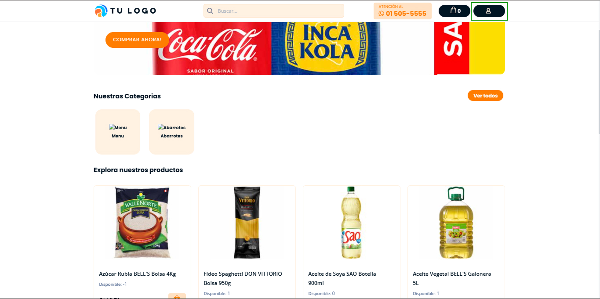
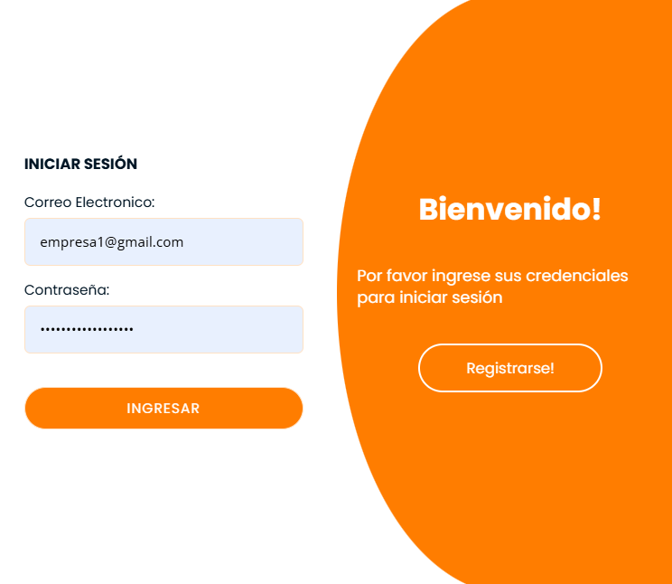
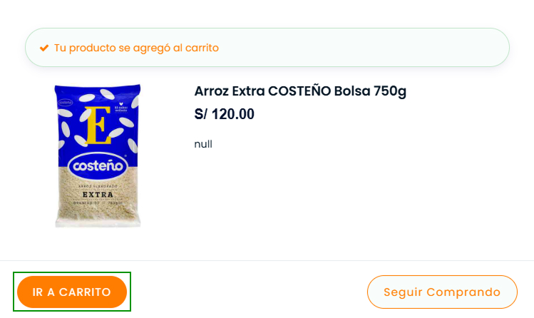
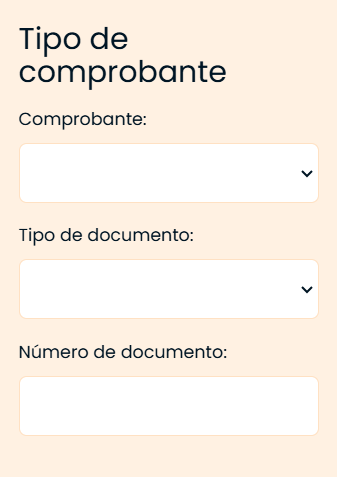
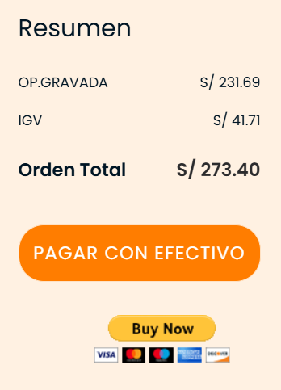
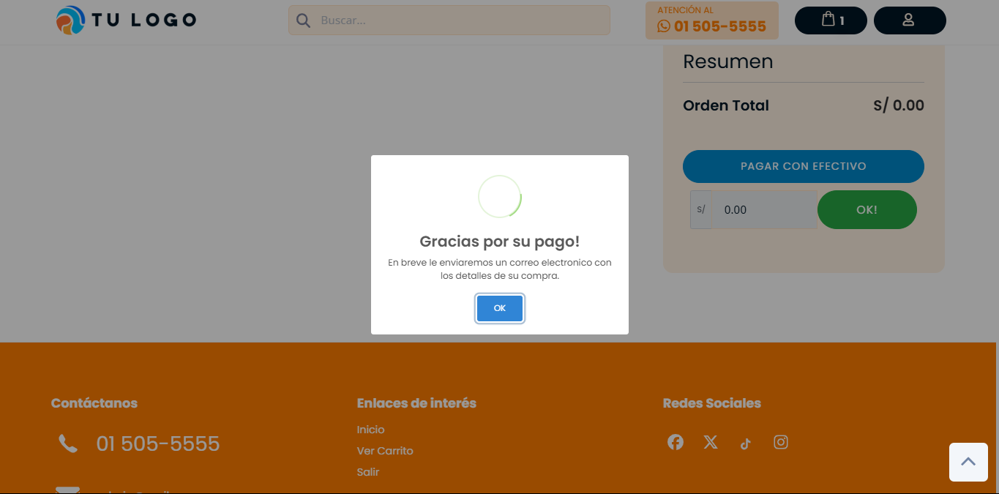

# Cómo mis clientes realizan pedidos

En esta área podrás conocer cómo tus clientes deben registrarse, añadir productos y realizar un pedido en la tienda virtual.

## Registrarse

Ingresa a la **tienda virtual** *(subdominio/ecommerce)*, luego dirígete al botón **Login** que está ubicado en la parte superior derecha de la página.

Después aparecerá una ventana para realizar el **nuevo registro** o puedes **iniciar sesión** en caso de haberte registrado anteriormente.

## Añadir productos

Luego añade el producto que deseas comprar, seleccionando el botón anaranjado de Añadir al carrito [🛒].

Posteriormente para visualizar los productos agregados, deberá ingresar a la sección de carrito de compras y seleccionar el botón **Ver carrito**.

## Carrito de compras

Se visualizarán diferentes funcionalidades de las secciones enumeradas:

1. **Lista de productos**
Encontrarás las siguientes secciones:

- **Producto:** Se mostrarán todos los productos que añadiste a tu carrito de compras
- **Precio:** Es el precio unitario de los productos
- **Cantidad:** Puedes añadir más productos según el stock disponible
- **Subtotal:** Es la suma parcial
- **Botón [x]:** Permite eliminar los productos añadidos
- **Limpiar carrito:** Permite eliminar todos los productos
- **Continuar comprando:** Permite continuar añadiendo más productos.

2. **Tipo de comprobante**
Encontrarás los siguientes campos:

* **Comprobante:** Selecciona el tipo de comprobante que requieras
* **Tipo de documento:** Selecciona el documento
* **Número de documento:** Agrega el número de documento según el tipo de documento seleccionado.

3. **Datos de contacto y envío**
Encontrarás los siguientes campos:

- Teléfono: Agrega el número de contacto
- Dirección: Agrega la dirección del domicilio donde desee recibir el pedido.

4. **Resumen y Pago**

En esta sección se visualizará el total de la compra y posteriormente,  para realizar el pago, se deberá seleccionar el método de pago correspondiente. Luego aparecerá un mensaje de **confirmación de pago exitoso**.

Para aprender a gestionar las verificaciones de pago en los pedidos realizados por el cliente, te invitamos a leer nuestro artículo **[Gestionar pedido](https://fastura.github.io/documentacion/tienda-virtual/Gestionar-Pedidos)**.
