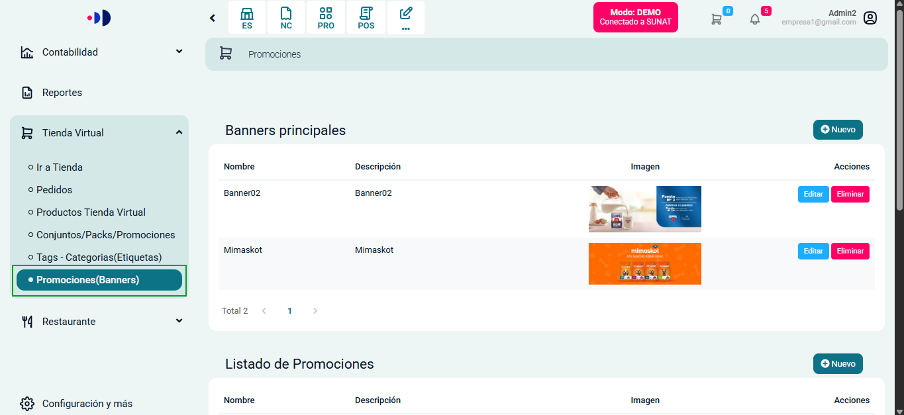
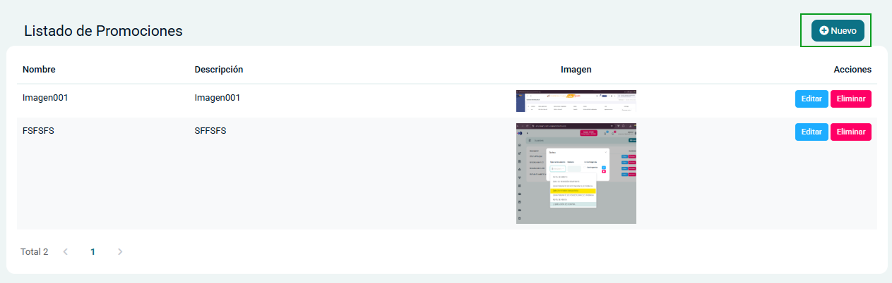
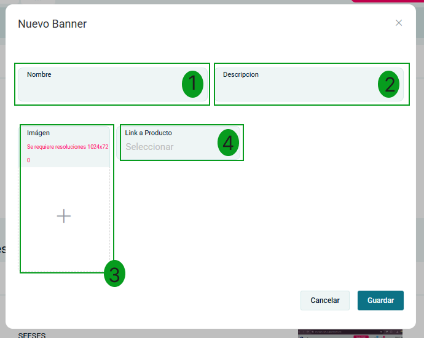

# Promociones (Banners) 

En esta sección podrás gestionar los elementos promocionales que aparecerán en tu tienda virtual, incluyendo anuncios publicitarios, promociones y banners principales.

## Acceso al Módulo de Promociones

Para acceder al módulo de promociones:

1. Ingresa al sistema con tus credenciales
2. Navega al módulo de **Tienda Virtual** en el menú lateral izquierdo
3. Selecciona la subcategoría **Promociones(Banners)**

## Tipos de Elementos Promocionales

El sistema permite gestionar tres tipos de elementos promocionales:

### 1. Banners Principales

Son imágenes destacadas que aparecen en la página principal de la tienda.

:::info NOTA:
Para la seccion de ***Banners Principales***, debe asegúrate que la imagen tenga la resolución de **1024 x 720 px** para un correcto despliegue y evitar distorsiones o mala visualización en la tienda.
:::

### 2. Promociones

Son ofertas especiales que pueden vincularse a productos específicos.

:::info NOTA:
Para la seccion de ***Promociones***, debe asegúrate que la imagen tenga la resolución de **1024 x 720 px** para un correcto despliegue y evitar distorsiones o mala visualización en la tienda.
:::

### 3. Anuncios Publicitarios

Son contenidos publicitarios que aparecen en diferentes secciones de la tienda.

:::info NOTA:
Para la seccion de ***Anuncios Publicitarios***, debe asegúrate que la imagen tenga la resolución de **570 x 146 px** para un correcto despliegue y evitar distorsiones o mala visualización en la tienda.
:::

## Gestión de Elementos Promocionales

### Visualizar Elementos

Cada tipo de elemento promocional (anuncios, promociones y banners) se muestra en una tabla con la siguiente información:
- **Nombre**: Identificador del elemento
- **Descripción**: Breve explicación del contenido
- **Imagen**: Vista previa del elemento visual
- **Acciones**: Botones para editar o eliminar

### Agregar Nuevo Elemento

Para crear un nuevo elemento promocional:

1. Haz clic en el botón **Nuevo** en la sección correspondiente
2. Se abrirá un formulario donde deberás completar:
   - **Nombre** (1): Identificador único del elemento
   - **Descripción** (2): Información detallada sobre el contenido
   - **Imagen** (3): Área para subir la imagen promocional
   - **Link a Producto** (4): Opción para vincular la promoción a un producto específico

:::info NOTA:
Para los banners principales se requieren imágenes con resolución 1024x720 píxeles.
:::

:::info NOTA:
Para los anuncios publicitarios se requieren imágenes con resolución 570x145 píxeles.
:::

3. Una vez completados los campos, haz clic en **Guardar**

### Editar Elemento Existente

Para modificar un elemento promocional:

1. Haz clic en el botón **Editar** en la fila del elemento que deseas modificar
2. Actualiza la información necesaria en el formulario
3. Haz clic en **Guardar** para confirmar los cambios

### Eliminar Elemento

Para eliminar un elemento promocional:

1. Haz clic en el botón **Eliminar** en la fila del elemento que deseas quitar
2. Confirma la acción cuando el sistema lo solicite

## Recomendaciones

- Utiliza imágenes de alta calidad que representen adecuadamente tus productos
- Mantén descripciones claras y concisas
- Actualiza regularmente tus promociones para mantener el interés de los clientes
- Verifica que las imágenes cumplan con las resoluciones requeridas para cada tipo de elemento

:::danger IMPORTANTE:
Recuerda que todos los elementos promocionales afectan directamente a la experiencia del usuario en tu tienda virtual. Asegúrate de que sean atractivos y relevantes.
:::

