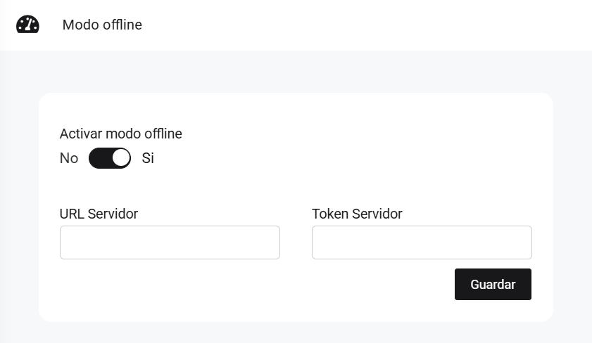

# Modo offline

En este artículo te enseñaremos a activar el modo offline de nuestro sistema. Sigue estos pasos para realizarlo:

Ingresa al módulo de **Configuración y más**, y luego en  **Avanzado** selecciona la subcategoría **Inventarios**.

Completa:

* **URL Servidor**
* **Token Servidor**

Seguido selecciona el botón **Guardar**
