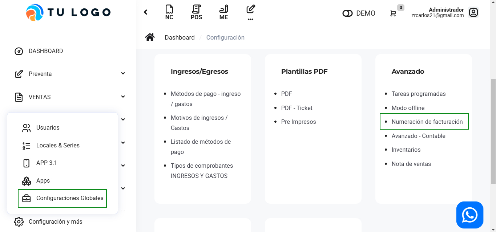
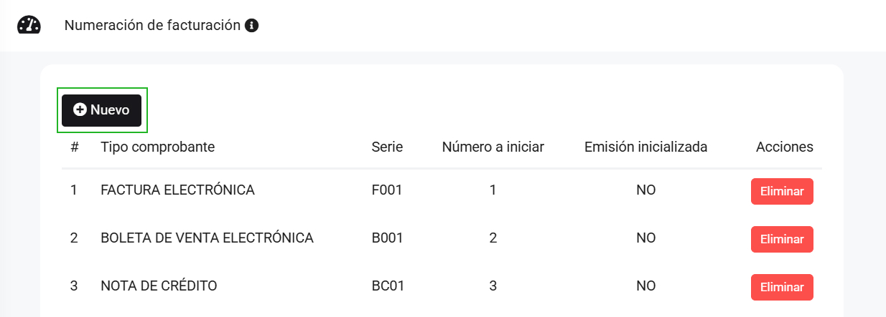
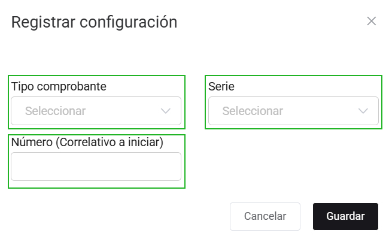

# Numeración de facturación

Si estas migrando desde otro proveedor a nuestra plataforma, para poder continuar con la numeración del correlativo de tus comprobantes,tenemos esta opción para ti. Sigue estos pasos para realizarlo:

Ingresa al módulo de **Configuración y más**, y luego en **Avanzado** selecciona la subcategoría **Numeración de facturación**.

Por consiguiente seleccionamos el botón **Nuevo**, donde nos aparecerá el formulario.

Completa:

* **Tipo de comprobante**
* **Serie**
* **Número (Correlativo a iniciar)**
  
Posteriormente selecciona **Guardar**, se podrá visualizar la lista de tipos de comprobantes y su número a iniciar.
