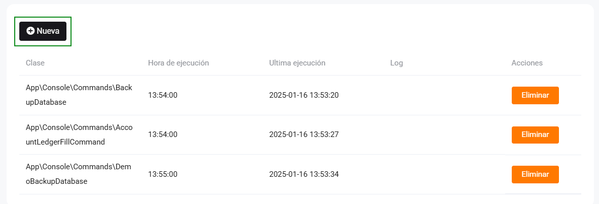
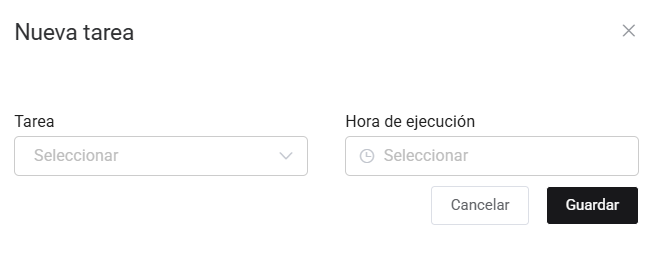

# Tareas programadas

En este artículo te enseñaremos a realizar la configuración necesaria para enviar las boletas mediante un resumen. Sigue estos pasos para realizarlo:

Ingresa al módulo de **Configuración y más** , luego en **Avanzado** selecciona la subcategoría **Tareas programadas**.

Por consiguiente selecciona el botón **Nuevo**, donde aparecerá la ventana general para llenar la **Nueva tarea**.

Completa:

* **Tarea: SummarySendCommand.**
* **Hora de ejecución:** Selecciona la hora de ejecución (de sugerencia en la noche).

Asimismo para enviarlo a **SUNAT**, seleccionamos una nueva **Tarea: SummaryQueryCommand** (de sugerencia una hora después a la tarea anterior).
