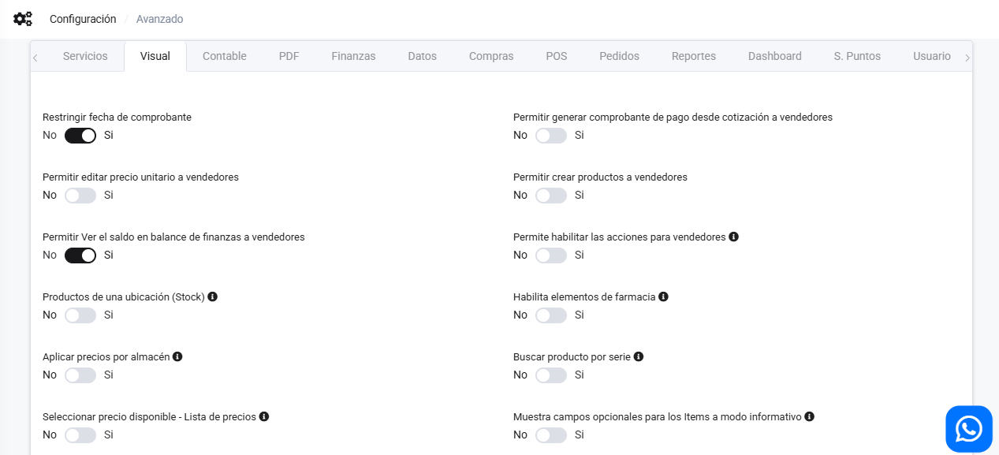
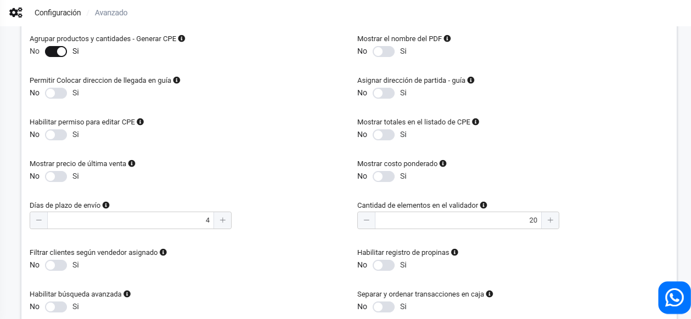
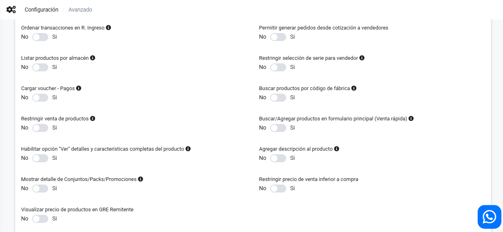
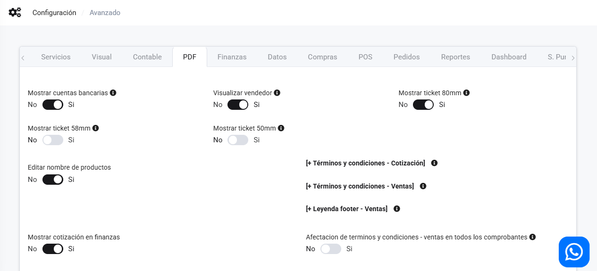
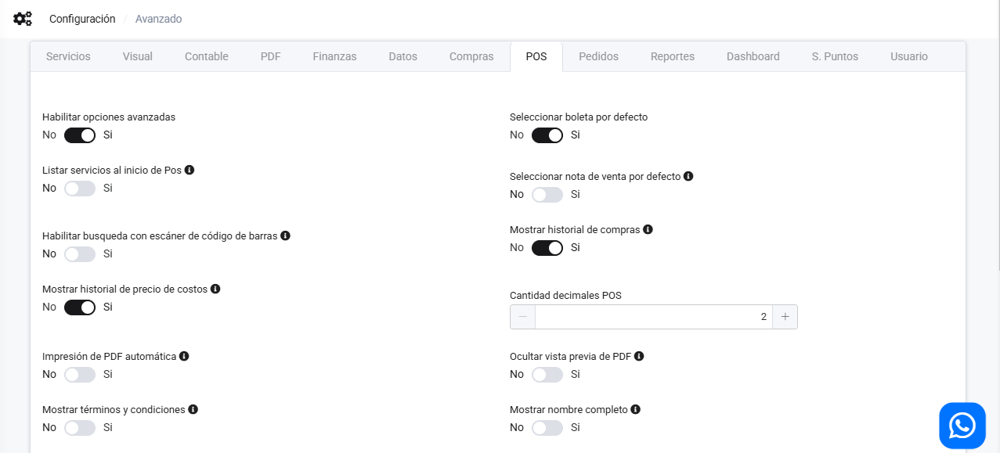
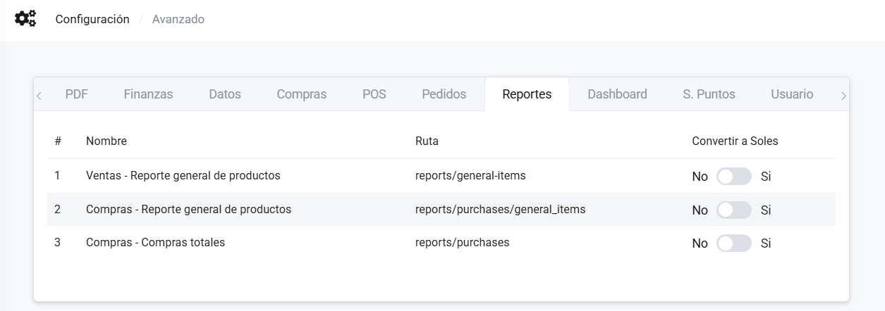
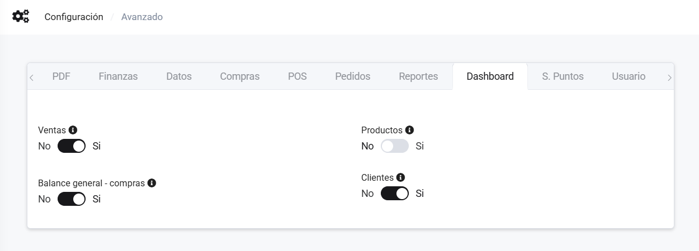
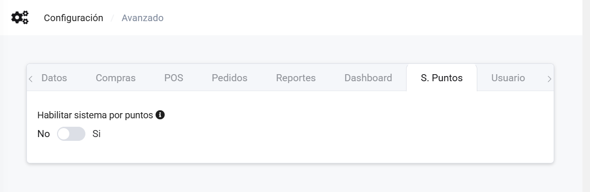
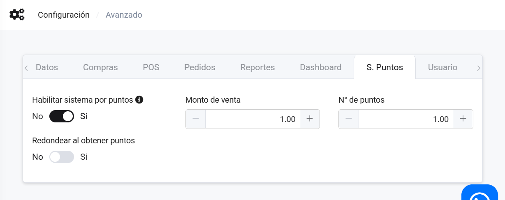
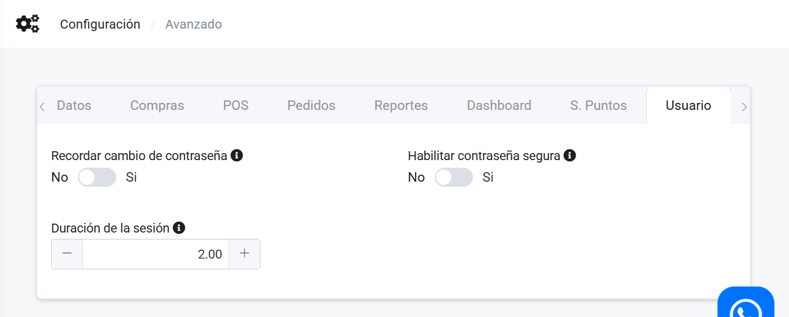

# Avanzado

En este artículo te ayudaremos a conocer todas las configuraciones que puedes realizar. Sigue estos pasos para realizarlo:

Ingresa al módulo de **Configuración** y luego en la subcategoría **Empresa**, selecciona **Avanzado**.

Aparecerá las configuraciones posibles por hacer:

## Servicios

* **Envío de comprobantes automático:** Esta configuración es para el envío de comprobantes de manera automática de facturas, notas de crédito y débito de facturas.
* **Crontab (Tareas Programadas):** Esta configuración es para tareas programas en caso la tenga activadas.
* **Envío de guía de remisión automático:** Esta configuración es para el envío de comprobantes de manera automática de guías de remisión.
* **Enviar boletas y notas asociadas (Crédito y Débito) de forma individual:** Esta configuración es para el envío de comprobantes de manera automática de boletas, notas de crédito y débito de boletas.
  
## Visual

* **Restringir fecha de comprobante:**Para activar una alerta que impida emitir un comprobante con una fecha anterior a las ya registradas.

* **Permitir generar comprobante de pago desde cotización a vendedores:** Permite a los vendedores generar comprobantes de pago directamente desde cotizaciones.

* **Permitir editar precio unitario a vendedores:** Habilita la opción para que los vendedores puedan editar el precio del producto.

* **Permitir crear productos a vendedores:** Autoriza a los vendedores a crear nuevos productos.

* **Permitir Ver el saldo en balance de finanzas a vendedores:** Da acceso a los vendedores para visualizar el saldo en el balance de finanzas.

* **Permite habilitar las acciones para vendedores:** Habilita distintas acciones específicas para vendedores en el sistema.

* **Productos de una ubicación (Stock):** Muestra el stock de los productos de un único almacén en el listado de productos o en la POS.

* **Habilita elementos de farmacia:** Activa la gestión de productos relacionados con farmacias, como la inclusión de códigos DIGEMID y registro sanitario.

* **Aplicar precios por almacén:** Permite aplicar precios diferentes por cada almacén en la POS.

* **Buscar producto por serie:** Habilita la búsqueda de productos por número de serie.

* **Seleccionar precio disponible - Lista de precios:** Permite seleccionar el precio de un producto de la lista de precios disponible.

* **Muestra campos opcionales para los Items a modo informativo:** Muestra campos adicionales para los ítems de manera informativa en el CPE.

* **Agrupar productos y cantidades - Generar CPE:** Agrupa o suma productos y cantidades al generar el CPE desde múltiples notas de venta.

* **Mostrar el nombre del PDF:** Muestra el nombre del producto en el PDF generado en lugar de la descripción del ítem.

* **Permitir Colocar dirección de llegada en guía:** Permite ingresar manualmente la dirección de llegada en la guía.

* **Asignar dirección de partida - guía:** Asigna la dirección de partida registrada en la información del establecimiento para la guía.

* **Habilitar permiso para editar CPE:** Asigna permisos a los usuarios para editar comprobantes electrónicos (CPE).

* **Mostrar totales en el listado de CPE:** Muestra los totales en el listado de CPE, disponible solo para usuarios administradores.

* **Mostrar precio de última venta:** Muestra el último precio de venta de un producto en su formulario.

* **Mostrar costo ponderado:** Muestra el costo ponderado de los productos en el sistema.

* **Días de plazo de envío:** Especifica los días permitidos de plazo para el envío en la validación de emisión de comprobantes.

* **Cantidad de elementos en el validador:** Establece el número máximo de elementos que se pueden validar en el nuevo validador de documentos.

* **Filtrar clientes según vendedor asignado:** Filtra los clientes según el vendedor que se les ha asignado.

* **Habilitar registro de propinas:** Habilita la opción de registrar propinas en la POS y durante la conversión de pedidos a CPE.

* **Habilitar búsqueda avanzada:** Habilita una búsqueda avanzada en las listas de productos, inventarios y reportes Kardex.

* **Separar y ordenar transacciones en caja:** Separa y ordena las transacciones de caja por tipo de documento en los reportes POS.

* **Ordenar transacciones en R. Ingreso:** Ordena las transacciones por tipo de documento en el reporte de ingresos.

* **Permitir generar pedidos desde cotización a vendedores:** Permite a los vendedores generar pedidos directamente desde las cotizaciones.

* **Listar productos por almacén:** Filtra y muestra los productos disponibles en el almacén asignado al usuario.

* **Restringir selección de serie para vendedor:** Configura la serie predeterminada para el vendedor en el registro de usuarios.

* **Cargar voucher - Pagos:** Habilita la opción de cargar un voucher de pago al registrar un documento.

* **Buscar productos por código de fábrica:** Habilita la búsqueda de productos mediante su código de fábrica en el sistema.

* **Restringir venta de productos:** Restringe la venta de productos específicos según las reglas configuradas.

* **Buscar/Agregar productos en formulario principal (Venta rápida):** Habilita la búsqueda y agregación de productos desde el formulario principal de venta rápida.

* **Habilitar opción "Ver" detalles y características completas del producto:** Muestra detalles y características adicionales del producto en su ficha.

* **Agregar descripción al producto:** Permite agregar descripciones detalladas a los productos en su ficha.

* **Mostrar detalle de Conjuntos/Packs/Promociones:** Muestra los detalles de conjuntos, packs o promociones activas en el sistema.

* **Restringir precio de venta inferior a compra:** Restringe que el precio de venta no sea inferior al precio de compra de los productos.

* **Visualizar precio de productos en GRE Remitente:** Habilita la opción de visualizar el precio de los productos en la Guía de Remisión Electrónica (GRE) del remitente.

## Contable

* **Impuesto bolsa plástica:** Insertar el valor del impuesto a la bolsa plástica en productos que lo requieran.
* **Impuesto incluido en registro de productos:** Al activar esta opción, se determina si el impuesto estará incluido en el precio del producto en su registro.
* **[+ Aplicar cargos]:** Permite añadir cargos adicionales en ventas, como en Comprobante Electrónico o Nota de Venta.
* **Moneda predeterminada:** Moneda que será utilizada por defecto en Nota de Venta y Comprobante Electrónico.
* **Nombre producto PDF para XML:** Define si el nombre del producto aparecerá en el XML del PDF en Notas de Venta o Comprobantes Electrónicos.
* **Tipo de descuento global:**
  * Tipo de descuento predeterminado en POS - Ventas/Comprobante electrónico
    **Sugerencias:**
  * Si la venta tiene op. gravadas utilice el descuento que afecta a la base imponible del IGV/IVAP.
  * Si la venta no tiene op. gravadas utilice el descuento que no afecta a la base imponible del IGV/IVAP.
* **Restringir envío de comunicación de baja (RA):** Se validará los días de plazo de envío para la anulación del documento - Disponible para anulaciones de Facturas y Notas relacionadas.
* **Asignar precio unitario a los productos desde registro relacionado:** Permite asignar el precio unitario de productos desde registros como Cotizaciones o Notas de Venta al generar un Comprobante Electrónico (CPE) desde Guía.
* **Modificar moneda al agregar producto:** Habilita la opción para cambiar la moneda al agregar productos en un Nuevo CPE, Nota de Venta o Cotización.
* **Tipo de afectación:** Establece el tipo de afectación predeterminada (Gravado, Exonerado) al registrar productos o servicios en sistemas como hoteles.
* **Caja General seleccionada por defecto:** Define si la caja general será la predeterminada en transacciones.
* **Modificar Tipo de afectación (Gravado - Bonificación):** Habilita la posibilidad de modificar el tipo de afectación del producto entre gravado o bonificación.
* **Porcentaje retención IGV:** Permite especificar el porcentaje de retención del IGV, disponible en la creación de un Nuevo CPE.
* **Redondear monto de detracción a valor entero:** Habilita el redondeo automático del monto de la detracción a un valor entero en facturas o boletas.
* **Restringir venta de productos menores al precio de compra:** Activa la restricción que impide la venta de productos a un precio inferior al de compra, disponible en Ventas/Comprobante Electrónico y Nota de Venta.
* **Días de plazo de envío de la comunicación de baja:** Define el número de días de plazo que tiene para enviar una comunicación de baja. Pasado el plazo, deberá realizar una Nota de Crédito. El valor actual es de 7 días.
* **Agregar leyenda al XML (Amazonía):** Añade la leyenda 2001 en el XML, disponible para Facturas y Boletas generadas en el sistema.
* **Agregar series al XML - Datos de vehículos:**
    * Registra las series vendidas como información adicional a nivel de item.
    * Usa el atributo con código 5019 - Serie/Chasis del catálogo 55 - Código de identificación del concepto tributario de Sunat.
    * Disponible para Facturas y Boletas.
* **Asociar establecimiento a cuenta bancaria:** Permite asociar el establecimiento registrado con una cuenta bancaria para procesar pagos y transacciones.
* **Modificar valores en previsualización del documento:** Habilita la opción para cambiar o ajustar valores en la previsualización de documentos antes de su emisión.

## PDF  

### Configuración General  

  

Completa los siguientes ajustes relacionados con la generación de documentos PDF:  

* **Mostrar cotización en finanzas:** Permite visualizar cotizaciones dentro del módulo de finanzas.  
* **Mostrar leyenda en footer - PDF:** Leyenda: Bienes transferidos y/o servicios prestados en la Amazonía para ser consumidos en la misma, disponible para facturas, boletas, notas y cotizaciones.  
* **Actualizar documento al generar guía:** Si se activa, al generar una guía basada en el documento, se actualizará el comprobante de pago correspondiente.  
* **Mostrar Logo por sucursal:** En los documentos PDF (CPE, Notas de venta, Cotizaciones), se incluirá el logo de la sucursal en la cabecera.  
* **Mostrar precio en etiqueta:** Permite mostrar el precio en la etiqueta de código de barras de productos.  
* **[+ Agregar imágenes al PDF]:** Permite incorporar imágenes relacionadas con el producto o servicio en el PDF generado.  

### Configuración de Tickets  

  

* **Mostrar ticket 80mm:** Disponible para Ventas (Facturas/Boletas/Notas de Crédito-Débito).  
* **Mostrar ticket 58mm:** Disponible para Ventas (Facturas/Boletas/Notas de Crédito-Débito).  
* **Mostrar ticket 50mm:** Disponible para Ventas (Facturas/Boletas/Notas de Crédito-Débito).  
* **Editar nombre de productos:** Permite modificar el nombre de los productos en los documentos generados.  

### Términos y Condiciones  

* **[+ Términos y condiciones - Cotización]:** Puedes insertar un campo de texto, y aparecerá en el documento de cotización.  
* **[+ Términos y condiciones - Ventas]:** Puedes insertar un campo de texto, y aparecerá en el documento de ventas.  

### Otros Ajustes  

* **Afectación de términos y condiciones - ventas en todos los comprobantes:** Aplica a facturas, boletas, notas de ventas y guías de remisión.  
* **Imagen para encabezado - PDF:** Disponible para facturas y boletas en formato A4, utilizando la plantilla `header_image_full_width`.  
* **Usar la descripción como nombre del producto PDF:** En factura/boleta, cotización y nota de venta, se usará la descripción como nombre del producto por defecto.  
* **Permite imprimir línea en el campo de observación:** En los documentos que tengan observaciones, permite ajustar el salto de línea. No aplica a tickets.  
* **Modificar cantidad de decimales:** Pertinente para el precio unitario de Facturas/Boletas en formatos A4/A5, utilizando la plantilla PDF `Default`.  

Asegúrate de ajustar estas configuraciones según tus necesidades antes de generar los documentos PDF.

## Finanzas

* **Aplicar penalidad a los pagos vencidos:** Si dese aplicar un monto extra a los pagos vencidos.

## Datos

- **Eliminar documentos de prueba:** Elimina todos los documentos realizadas de prueba cuando el sistema se encontraba en modo prueba.
- **Eliminar productos:** Está opción permite eliminar todos los productos del sistema.
- **Omitir validación de correo:** Al seleccionar "Sí", desactiva la verificación del correo electrónico, agilizando el proceso sin requerir confirmación.Util en ciertos flujos de trabajo que no dependen de la validación.

:::danger importante

 Eliminar documentos de prueba, no elimina movimientos como número de stock, pagos ingresados.

:::

## Compras

* **Poder cambiar el IGV global de los items en la compra:** Poder cambiar el IGV de compra.
* **Seleccionar por defecto Actualizar precio de compra:** Poder actualizar el precio de compra, disponible en compras.
* **Seleccionar por defecto Poder cambiar el IGV global de los items en la compra:** Solo aplica si la configuración 'Poder cambiar el IGV global de los items en la compra' se encuentra habilitada.
* **Asignar moneda global de la compra a los items:** Al agregar el item se seleccionará por defecto la moneda global elegida.

## POS

* **Habilitar opciones avanzadas:** Habilita las opciones avanzadas del módulo POS.
* **Listar servicios al inicio de Pos:** Normalmente, los servicios necesitan ser buscados, en este caso, se podrán listar al inicio.
* **Habilitar búsqueda con escáner de código de barras:** Disponible POS y Venta rápida.
* **Mostrar historial de precio de costos:** Permite a los usuarios con perfil Vendedor, ver el historial de precio de costos.
* **Impresión de PDF automática:**
* **POS:** Al realizar un pago se envía el documento a la impresora, seguir documentación para un funcionamiento correcto.
* **Nuevo CPE:** Al finalizar el registro del comprobante se envía a la impresora
* **Mostrar términos y condiciones:** Añadir texto en el campo de términos y condiciones (ventas) de la pestaña "PDF".
* **Habilitar restricción para descuento:** Se limitará el porcentaje de descuento que pueden registrar los vendedores por cada venta - Disponible en POS.
* **Habilitar Agente de ventas:** Se limitará el porcentaje de descuento que pueden registrar los vendedores por cada venta - Disponible en POS.
* **Activar descuento por cliente:** Si agregamos un cliente en el POS, te permite crear descuento especial por cliente.
* **Seleccionar boleta por defecto:** Disponible POS y Venta rápida.
* **Seleccionar nota de venta por defecto:** Disponible POS y Venta rápida.
* **Mostrar historial de compras:** Permite a los usuarios con perfil Vendedor, ver el historial de compras.
* **Cantidad decimales POS:** Ingresa la cantidad de decimales, el mínimo es 2
* **Ocultar vista previa de PDF:** Disponible en POS y Nuevo CPE.
* **Mostrar nombre completo:**  Mostrar nombre completo en listado de productos.

* **Habilitar vista categorías y productos:** Disponible en POS.
* **Modificar tipo de afectación:** Permite modificar el tipo de afectación Gravado a Exonerado o viceversa - Disponible en POS/Venta rápida.
* **Habilitar ticket de despacho:** Agrega el ticket de despacho al pdf formato ticket - Disponible en POS (CPE - Nota de venta).
* **Habilitar ticket de despacho individual:** Activa la opción de emitir un ticket de despacho individual por cada pedido, permitiendo un control más específico sobre los envíos.
* **Agregar producto al seleccionar precio:** Al activar esta opción, cuando se selecciona un precio en la pantalla del POS, el producto correspondiente se agregará automáticamente al carrito de compra, optimizando el flujo de ventas.
* **Convertir a CPE:** Habilita la posibilidad de convertir el comprobante de venta en un Comprobante de Pago Electrónico (CPE) que cumple con las normativas de SUNAT, facilitando la validación y el envío de documentos tributarios.

## Pedidos

* **Habilitar importación de MiTienda.Pe:** Requiere modificaciones en configuracion -> avanzado -> pedidos.
* **Gestión avanzada de pedidos:** Permite habilitar opciones adicionales para gestionar los pedidos con más detalle y control dentro del sistema. Esto puede incluir la priorización de pedidos, manejo avanzado de inventario y opciones de logística mejoradas.

## Reportes

* **Ventas - Reporte general de productos:** Al activar esta opción, se convertirá a soles, caso contrario se mostrará dos líneas: totales de **soles** y **dólares**.
* **Compras - Reporte general de productos:** Al activar esta opción, se convertirá a soles, caso contrario se mostrará dos líneas: totales de **soles** y **dólares**.
* **Compras - Compras totales:** Al activar esta opción, se convertirá a soles, caso contrario se mostrará dos líneas: totales de soles y dólares.

## Dashboard

Puede habilitar que observará en la página principal que es el Dashboard.

* **Ventas:** Gráfico notas de ventas, comprobantes y totales.
* **Balance general - compras:** Gráfico de balance, Utilidades/Ganancias y compras.
* **Productos:** Ventas por producto, productos por agotarse, productos por vencer.
* **Clientes:** Top de clientes.

## S. Puntos

Si desea que su cliente acumule puntos y pueda canjearlos.

Al activar esta opción, les aparecerá lo siguiente:

* **Monto de venta:** Inserta el monto de venta con el que desea que acumulen puntos.
* **N° de puntos:** Inserta el número de puntos que acumulara según el monto de venta.
* **Redondear al obtener puntos:** Si desea redondear los puntos que se acumulo.

## Usuario

* **Recordar cambio de contraseña:** Se mostrará una notificación cuando se cumpla el plazo asignado en meses, desde la fecha de la última actualización de contraseña.
* **Habilitar contraseña segura:** Se solicitará una contraseña segura (cumplir patrón) al registrar usuario.
* **Duración de la sesión:** Permite configurar el tiempo máximo que una sesión de usuario puede permanecer activa antes de cerrarse automáticamente por inactividad. En este sistema, el valor predeterminado es de 24 horas. 