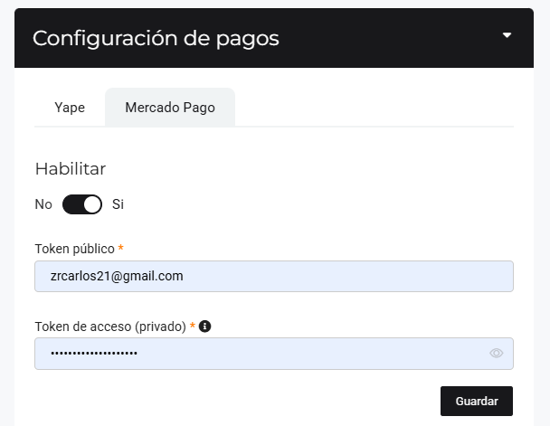

# Configuración Previa

En esta área te ayudaremos a realizar la configuración previa para generar link de pago. Sigue estos pasos para realizarlo:

Ingresa al módulo de **Configuración** y luego en la subcategoría **Empresa** y selecciona **Avanzado.** 

## Configurar lo siguiente

### Yape

Podrá habilitar yape, seleccionando el interruptor, al activar le aparecerán los siguientes campos:

* **Número de teléfono:** Inserta el número de teléfono que tiene registrado en yape.
* **Nombres y Apellidos:** Inserta los nombres y apellidos que están registrados en yape.
* **Adjuntar código QR (Imagen):** Inserta la imagen del **código QR** que te registra en yape.
Seguido, selecciona el botón **Guardar.**

### Mercado de Pago

Podrá habilitar Mercado Pago, seleccionando el interruptor, al activar le aparecerán los siguientes campos:

Los tokens se copiaran en su cuenta de mercado pago.

Seguido, selecciona el botón **Guardar.**
