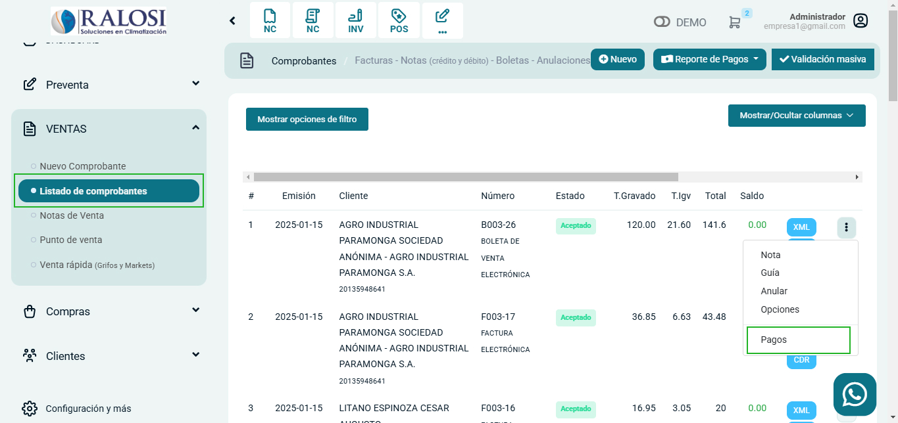
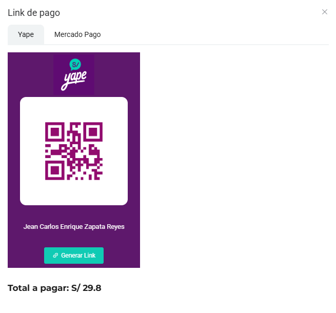
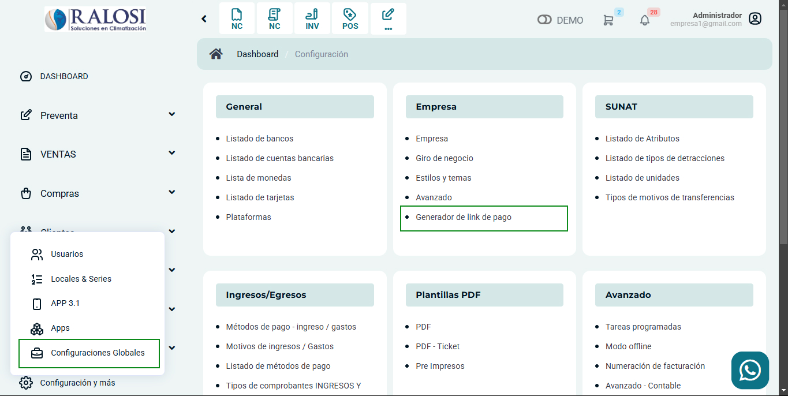
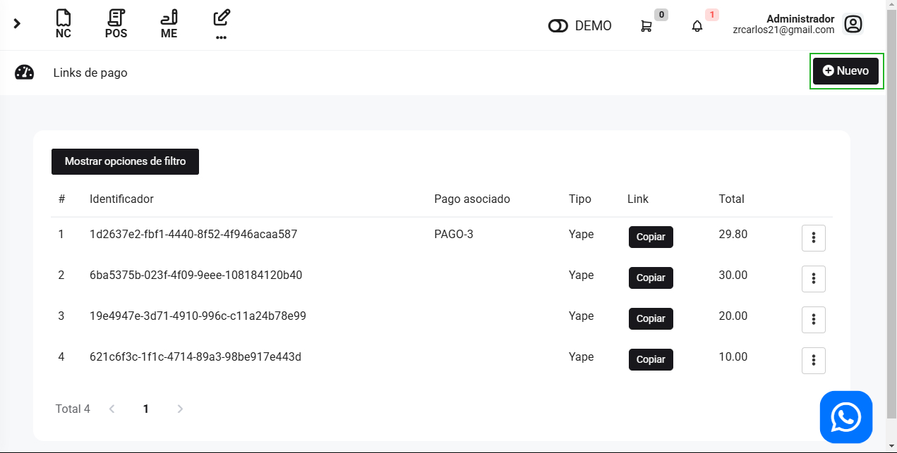
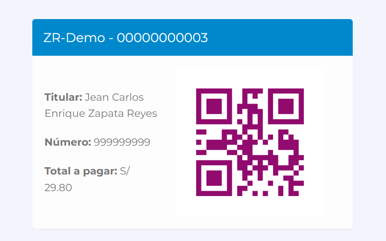

# Genera el Link

En esta área te ayudaremos a crear links de pagos de dos maneras. Sigue estos pasos para realizarlo:

## Anexado a un comprobante electrónico

Para generar un link de pago desde un comprobante electrónico, nos dirigimos a **Listado de comprobantes**, seleccionamos el botón con los tres puntos y selecciona **Pago.**

Seguido selecciona Nuevo.

Completa lo siguiente:

* **Método de pago:** Selecciona el método de pago.
* **Destino:** Selecciona el destino.
* **Monto:** El monto se podrá observar
* **¿Pago recibido?:** Selecciona si el pago fue recibido.
* **Link de pago:** Selecciona el botón **Link de pago.**

Podrá escoger si el link sera por **Yape** o **Mercado Pago**

Luego selecciona el botón **Generar Link**

Ahí podrá copiar el link, enviar correo, enviar whatsapp seleccionando el botón correspondiente. Seleccionando el botón adjuntar pago, podrá subir la foto del pago.

## De manera independiente

Para  generar links de pagos de manera independiente, ingresa al módulo de **Configuración y más**, ubica el submodulo **Empresa**.

Elija la opcion de **Generar Link de Pago**, en la parte superior derecha selecciona el botón **Nuevo**.

Completa el siguiente campo:

* **Tipo:** Selecciona Yape o Mercado Pago.
* **Total:** Inserta el total.

Seguido selecciona el botón **Guardar**. Se observará los links de pago generados.

Selecciona el botón **Copiar**, y tendrá el enlace.

