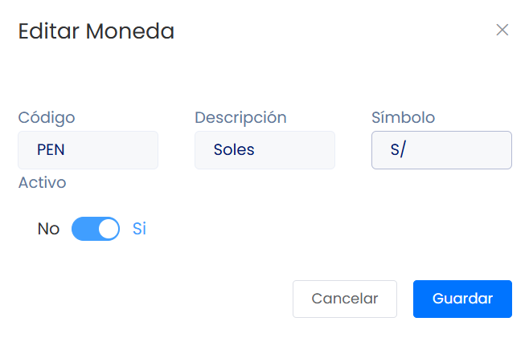

# Lista de monedas

En este artículo te enseñaremos verificar el listado de monedas. Sigue estos pasos para realizarlo:

Ingresa al módulo de **Configuración**, y luego en **General** selecciona la subcategoría **Listado de monedas**.

Nuestro sistema de facturación cuenta con dos tipos de monedas:

Se puede editar la descripción, el símbolo y decidir si ese tipo de moneda estará activo para su sistema:

