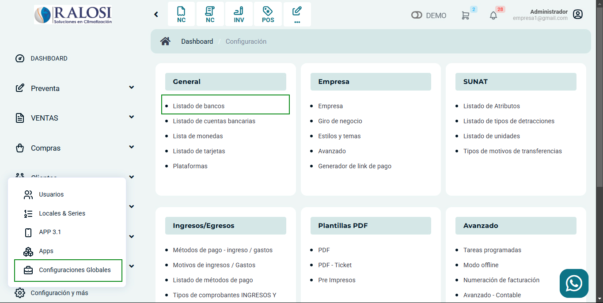
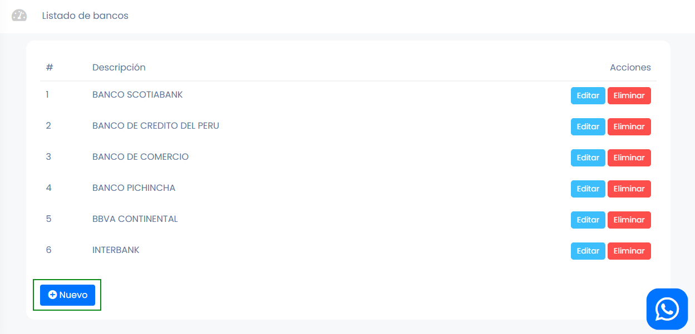
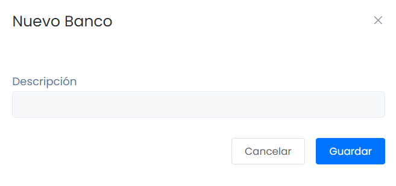

# Listado de bancos

En este artículo te enseñaremos a agregar nuevos bancos. Sigue estos pasos para realizarlo:

Ingresa al módulo de **Configuración**, y luego en **General** selecciona la subcategoría **Listado de bancos**.

Observará el listado de bancos, para crear uno selecciona el botón **Nuevo**.

Completa:

* **Descripción:** Inserta el nombre de su banco de preferencia.
  
Seguido selecciona el botón Guardar. Y podrá observar su banco creado en el listado de bancos.
