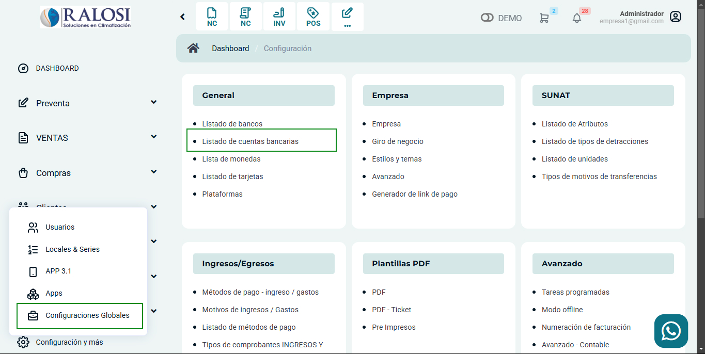
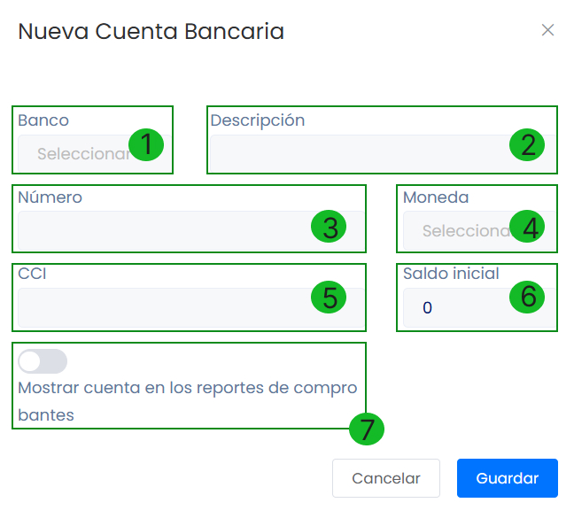

# Listado de cuentas bancarias

En este artículo te enseñaremos a agregar cuentas bancarias. Sigue estos pasos para realizarlo:

Ingresa al módulo de **Configuración**, y luego en General selecciona la subcategoría **Listado de cuentas bancarias**.

Observará el listado de cuentas bancarias, para crear uno selecciona el botón **Nuevo**.

Completa:

* **Banco:** Selecciona el banco, si no encuentra el banco de su preferencia, puede crearlo con ayuda de este artículo.
* **Descripción:** Inserta una breve descripción.
* **Número:** Inserta el número de cuenta. 
* **Moneda:** Inserta el tipo de moneda de la cuenta.
* **CCI:** Inserta el CCI de la cuenta.
* **Saldo Inicial:** Ingresa el saldo que tiene actualmente en la cuenta.
* **Mostrar cuenta en los reportes de comprobantes:**  Activa si desea que la cuenta bancaria aparezca en su comprobante electrónico.

Seguido selecciona el botón **Guardar**. Y podrá observar su cuenta bancaria creado en el listado de cuentas bancarias.
