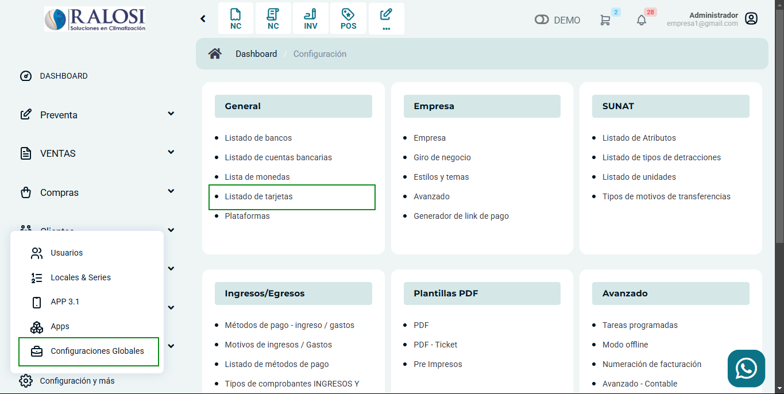

# Listado de tarjetas

En este artículo te enseñaremos a agregar cuentas bancarias. Sigue estos pasos para realizarlo:

Ingresa al módulo de **Configuración**, y luego en **General** selecciona la subcategoría **Listado de tarjetas**.

Observará el listado de tarjetas, para crear una selecciona el botón **Nuevo**.

Completa:

* **Código:** Inserta el código que le dará a la tarjeta.
* **Descripción:** Inserta el nombre de la tarjeta.
  
Seguido selecciona el botón **Guardar**. Y podrá observar su tarjeta creada en el listado de tarjetas, podrá editar y eliminar la tarjeta seleccionando el botón correspondiente.
