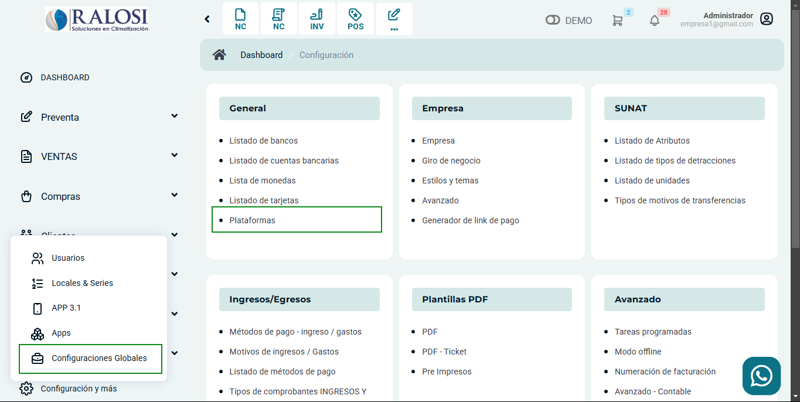

# Plataformas

En este artículo te enseñaremos a agregar plataformas. Sigue estos pasos para realizarlo:

Ingresa al módulo de **Configuración**, y luego en **General** selecciona la subcategoría **Plataformas**.

Observará el listado de plataformas, para crear una selecciona el botón **Nuevo**.

Completa:

* **Nombre:** Ingresa el nombre de la nueva plataforma.
  
Seguido selecciona el botón **Guardar**. Y podrá observar la nueva plataforma creada.
