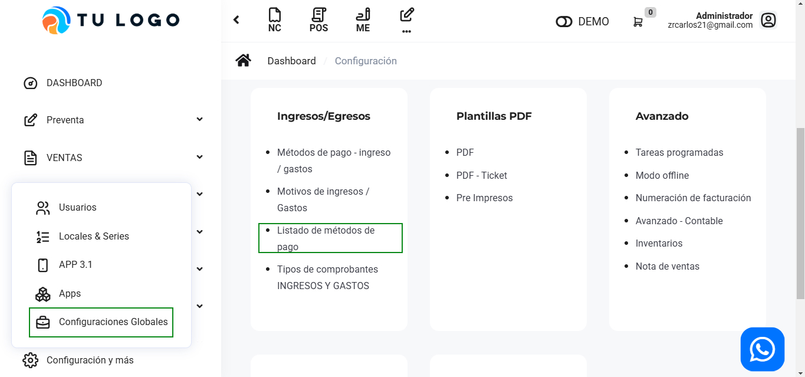
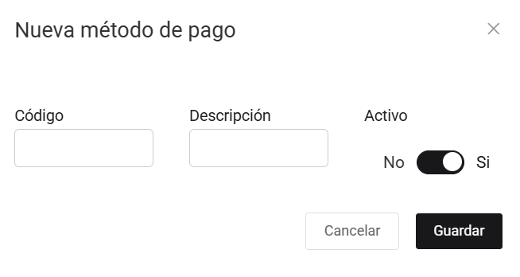

# Listado de métodos de pago

En este artículo te enseñaremos a agregar métodos de pago. Sigue estos pasos para realizarlo:

Ingresa al módulo de **Configuración**, y luego en  **Ingresos/Egresos** selecciona la subcategoría **Listado de métodos de pago**.

Observará el listado de métodos de pago, para crear una selecciona el botón **Nuevo**.

Completa:

* **Código:** Insertar el código del nuevo método de pago.
* **Descripción:** Inserta el nombre del nuevo método de pago.
* **Activo:** Selecciona si el método estará activo.
  
Seguido selecciona el botón **Guardar**. Y podrá observar su método de pago creado, podrá editar y eliminar la tarjeta seleccionando el botón correspondiente.

:::danger importante

Estas opciones aparecen cuando selecciona el tipo de operación: **Operación sujeto a detracción.**

:::
