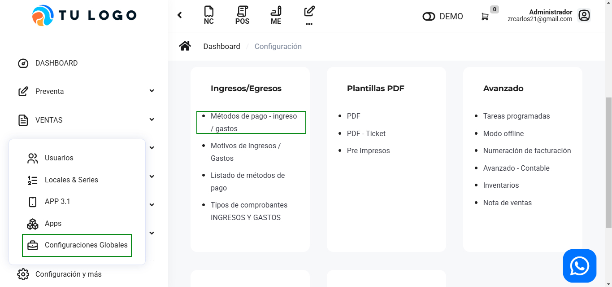
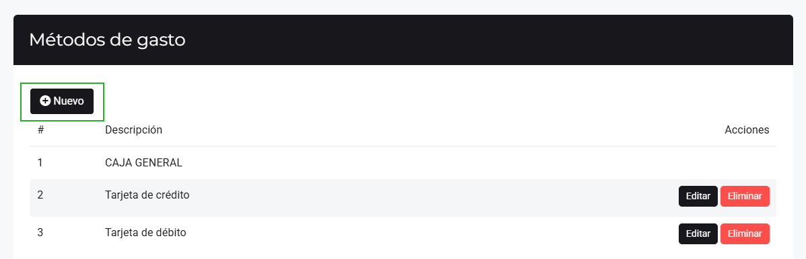
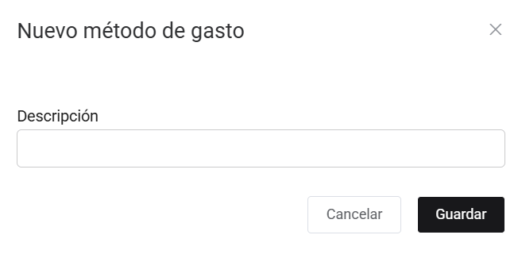
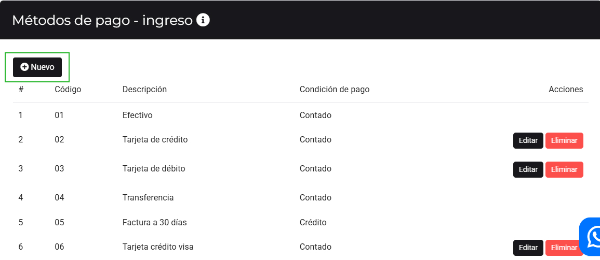
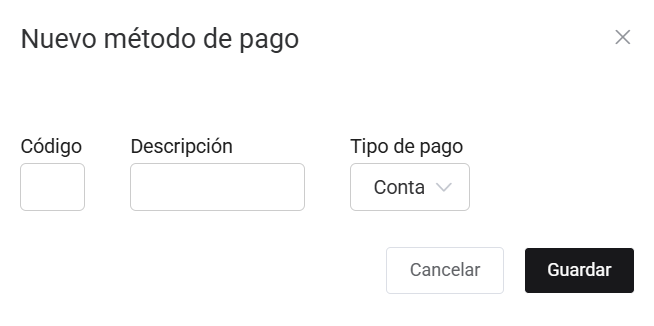

# Métodos de pago - Ingreso / Gasto

En este artículo te enseñaremos a agregar métodos de gasto y métodos de pago. Sigue estos pasos para realizarlo:

Ingresa al módulo de **Configuración**, y luego en **Ingresos/Egresos** selecciona la subcategoría **Métodos de pago - ingresos / gastos**.

## Métodos de gasto

Observará el listado de Métodos de gasto, para crear uno selecciona el botón **Nuevo**.

Completa:

* **Descripción:** Inserta el nombre del nuevo método de gasto.
  
Seguido selecciona el botón **Guardar**. Y podrá observar su nuevo método de gasto.

## Métodos de pago - ingreso

Observará el listado de Métodos de pago, para crear uno selecciona el botón **Nuevo**.

Completa:

* **Código:** Inserta el código del nuevo método de pago.
* **Descripción:** Inserta la descripción del método de pago.
* **Tipo de pago:** Selecciona el tipo de pago. Si es contado o crédito.
  
Seguido selecciona el botón **Guardar**. Y podrá observar su nuevo método de pago.

