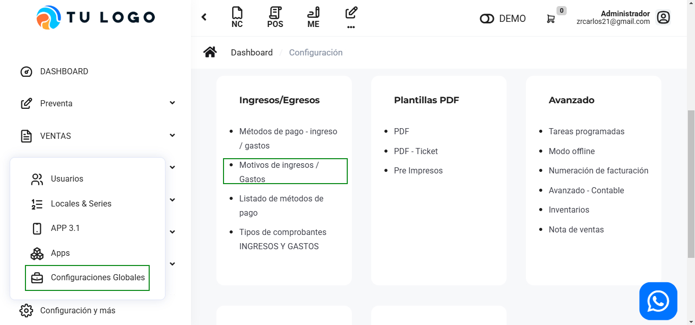
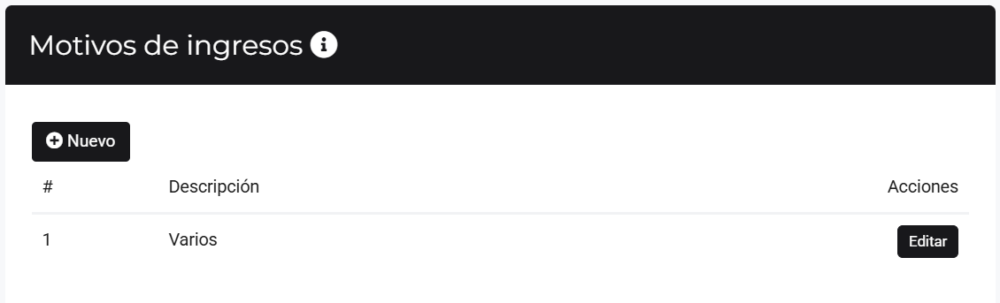

# Motivos de Ingresos / Gastos

En este artículo te enseñaremos a agregar motivos de gastos y motivos de ingresos. Sigue estos pasos para realizarlo:

Ingresa al módulo de **Configuración**, y luego en  **Ingresos/Egresos** selecciona la subcategoría **Motivos de ingresos / Gastos**.

## Motivos de gastos

Observará el listado de Motivos de gasto, para crear uno selecciona el botón Nuevo.

Completa:

* **Descripción:** Inserta el nombre del nuevo motivo de gasto.
  
Seguido selecciona el botón **Guardar**. Y podrá observar su nuevo motivo de gasto, podrá editar y eliminar el motivo de gasto seleccionando el botón correspondiente.

## Motivo de ingresos

Completa:

* **Descripción:** Inserta el nombre del nuevo método de gasto.
  
Seguido selecciona el botón **Guardar**. Y podrá observar su nuevo motivo de ingreso, podrá editar y eliminar la tarjeta seleccionando el botón correspondiente.
