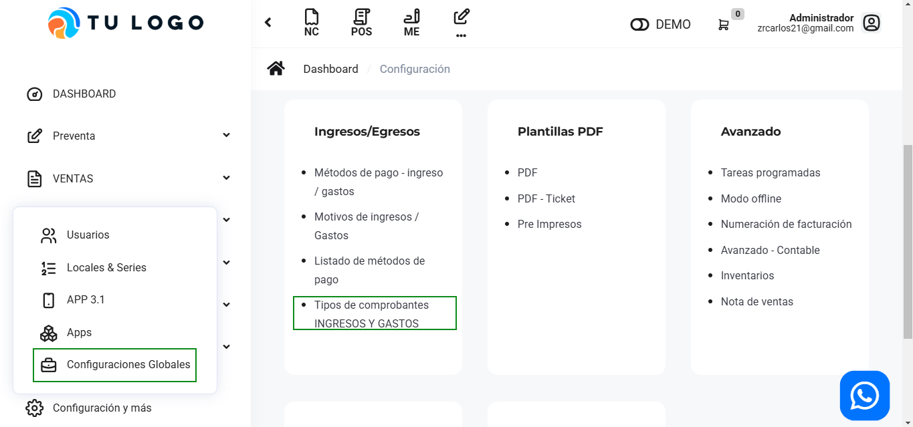
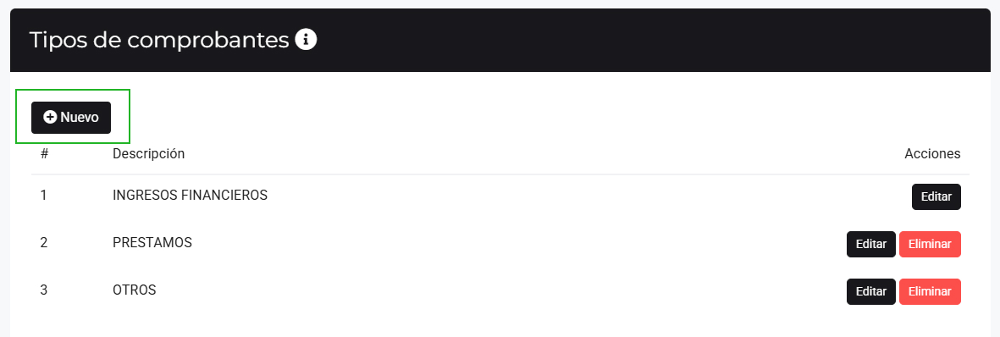
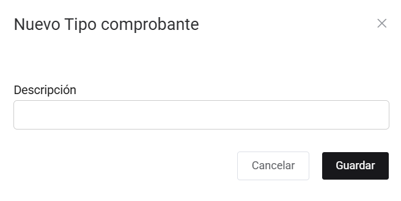

# Tipos de comprobantes INGRESOS Y GASTOS

En este artículo te enseñaremos a agregar los tipos de comprobantes de ingresos y gastos. Sigue estos pasos para realizarlo:

Ingresa al módulo de **Configuración**, y luego en **Ingresos/Egresos** selecciona la subcategoría **Tipos de comprobantes INGRESOS Y GASTOS**.

### Tipos de comprobantes (ingresos)

Observará el listado de tipos de comprobantes, para crear uno selecciona el botón **Nuevo**.

Completa:

* **Descripción:** Inserta el nombre del nuevo tipo de comprobante.
  
Seguido selecciona el botón **Guardar**. Y podrá observar su nuevo tipo de comprobante, podrá editar y eliminar el motivo de gasto seleccionando el botón correspondiente.

## Tipos de comprobantes (Gastos diversos)

Observará el listado de tipos de comprobantes para crear uno selecciona el botón **Nuevo**.

Completa:

* **Descripción:** Inserta el nombre del nuevo tipo de comprobante.
  
Seguido selecciona el botón **Guardar**. Y podrá observar su nuevo motivo tipo de comprobante, podrá editar y eliminar el motivo de gasto seleccionando el botón correspondiente.
