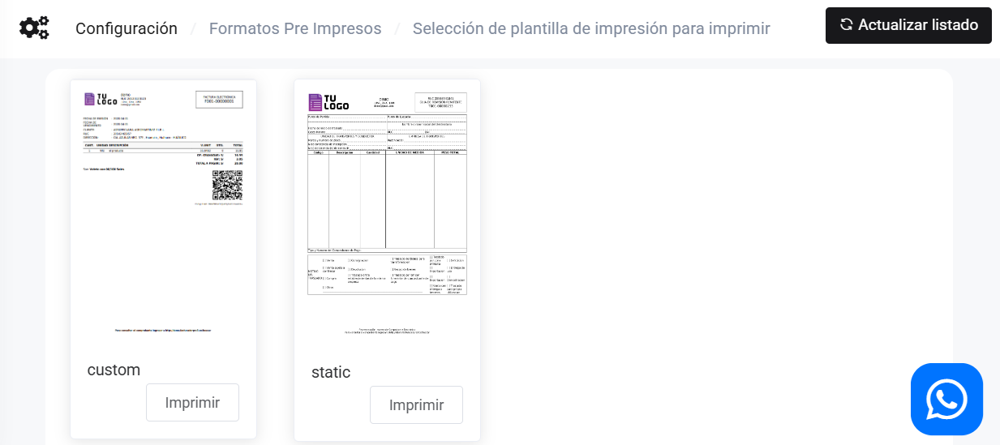

# Plantillas PDF - Pre Impresas

En este artículo te enseñaremos a cambiar tu plantilla PDF pre impresos. Sigue estos pasos para realizarlo:

Ingresa al módulo de **Configuración**, luego en la categoría **Plantillas PDF** selecciona **Pre Impresos**. Elige la que más se adecue a tu empresa.

Selecciona el establecimiento y activa la plantilla que utilizará en su formato pre impresos.

:::info importante

En caso no visualice las plantillas selecciona el botón **Actualizar listado** en la parte superior derecha.

:::
