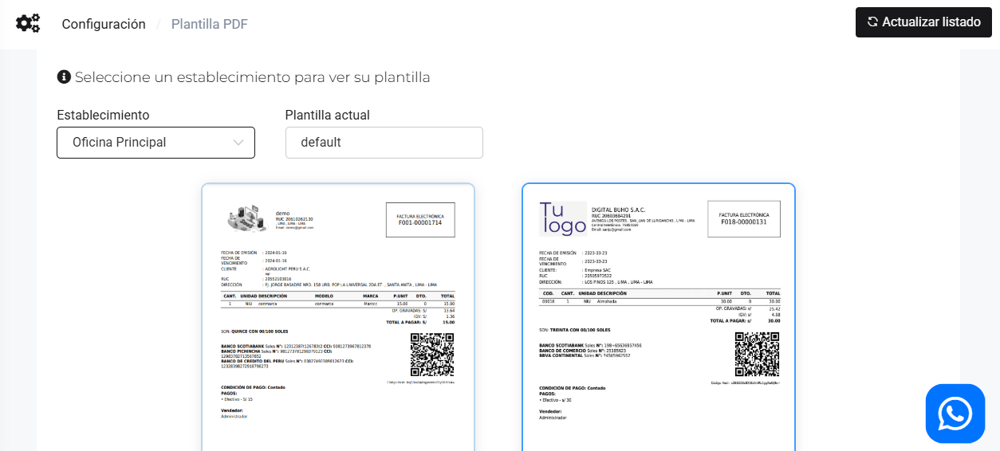

# Plantilas PDF

En este artículo te enseñaremos a cambiar tu plantilla PDF a la que más te agrade. Sigue estos pasos para realizarlo:

Ingresa al módulo de **Configuración**, luego en la categoría **Plantillas PDF** selecciona **PDF**. Elige la que más se adecue a tu empresa.

Selecciona el establecimiento y activa la plantilla que utilizará en sus comprobantes.

:::info importante

En caso no visualice las plantillas, selecciona el botón **Actualizar listado** en la parte superior derecha.

:::
