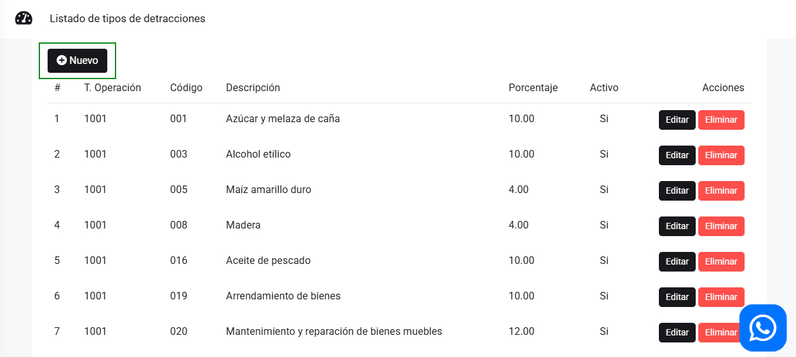

# Listado de tipos de detracciones

El **Listado de Tipos de Detracciones** de la SUNAT especifica los códigos asociados a productos o servicios sujetos al sistema de detracciones. Las detracciones son un mecanismo mediante el cual se retiene un porcentaje del pago por determinados bienes y servicios, con el fin de asegurar el cumplimiento de las obligaciones tributarias.

Cada tipo de detracción está identificado por un **código** que corresponde a un bien o servicio específico, lo que facilita su gestión dentro del sistema tributario.

Para agregar más detracciones, dirígete a **Configuración y más**, luego selecciona **Configuraciones Globales** y, a continuación, haz clic en **Listado de tipos de detracciones**.

Listado de tipo de detracciones, para productos o servicios:

Leyenda:

* **CÓDIGO  → Descripción**
* 001  → Azúcar y melaza de caña
* 003  → Alcohol etílico
* 005  → Maíz amarillo duro
* 008  → Madera
* 016  → Aceite de pescado
* 019  → Arrendamiento de bienes
* 020  → Mantenimiento y reparación de bienes muebles
* 022  → Otros servicios empresariales
* 023  → Leche
* 025  → Fabricación de bienes por encargo
* 027  → Servicio de transporte de carga

:::danger IMPORTANTE:
Puedes crear un nuevo tipo de detracción seleccionando el botón **Nuevo**, asegurándote previamente de verificar el código correspondiente. Es fundamental utilizar el código correcto para garantizar que el producto o servicio esté correctamente clasificado dentro del sistema de detracciones y cumpla con las normativas tributarias.
:::

