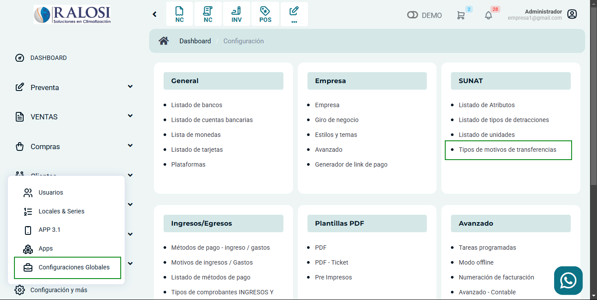

# Tipos de motivos de transferencias

El **Listado de Tipos de Motivos de Transferencias** de la SUNAT especifica los códigos que identifican los diversos motivos por los cuales se realiza la transferencia de productos o servicios. Estos códigos son fundamentales para registrar correctamente las operaciones en los documentos tributarios, tales como facturas y guías de remisión.

Cada motivo está asociado a un **código** y una **descripción**, lo que facilita la clasificación de las transferencias según su naturaleza, como ventas, compras, importaciones, exportaciones y otros tipos de movimiento.

Para agregar más tipo de motivos de transferencias, dirígete a **Configuración y más**, luego selecciona **Configuraciones Globales** y, a continuación, haz clic en **Tipos de motivos de transferencias**.

Leyenda:

* **CÓDIGO → Descripción**

* 01 → Venta
* 02 → Compra
* 04 → Traslado entre establecimientos de la misma empresa
* 08 → Importación
* 09 → Exportación
* 13 → Otros no comprendido en ningún código del presente catálogo
* 14 → Venta sujeta a confirmación del comprador
* 18 → Traslado emisor itinerante de comprobantes de pago Aquí no se está considerando el traslado a zona primaria.
* 19 → Traslado a zona primaria
* 03 → Venta con entrega a terceros
* 05 →  Consignación
* 06 → Devolución
* 07 → Recojo de bienes transformados
* 17 → Traslado de bienes para transformación

:::danger IMPORTANTE:
Para crear un nuevo tipo de detracción, ingresa al módulo **Configuración** y, en la subcategoría **SUNAT**, selecciona **Tipos de Motivos de Transferencias**. Luego, haz clic en el botón **Nuevo**. Asegúrate de haber verificado previamente el código correspondiente al tipo de transferencia, para garantizar que se registre correctamente de acuerdo a las normativas de la SUNAT.
:::

