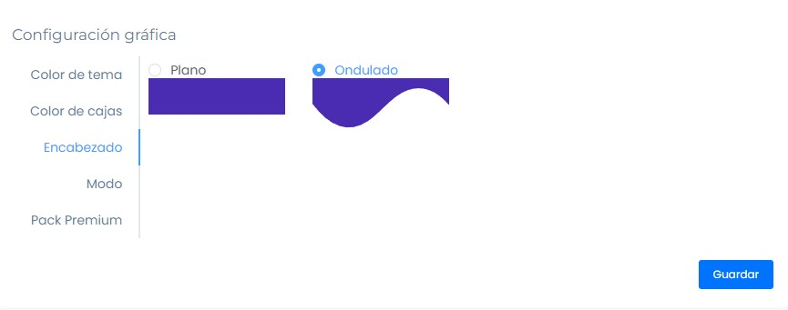

# Configuración gráfica

En este artículo te enseñaremos a realizar una configuración visual de tu app. Sigue estos pasos para realizarlo:

Ingresa al módulo de **Generador APP 2.0**, se observará la configuración gráfica.

## Color de tema

Selecciona el color de su preferencia.

## Color de cajas

Selecciona el color de cajas de su preferencia.

## Encabezado

Selecciona el encabezado de su preferencia.

:::danger IMPORTANTE:

- Todos los cambios se visualizaran en el emulador del lado derecho.
:::

## Modo

Selecciona el modo de su preferencia.

Tipos:

- **Standard:** El modo standard al ingresar se visualizara todos los módulos.
- **Punto de venta:** El modo punto de venta, es similar a Caja chica POS.

## Pack Premium

Estará disponible próximamente,  tendrá un costo muy aparte de los servicios que tenga contratados.

Selecciona el botón **Guardar**, para que se guarde todos los cambios.
