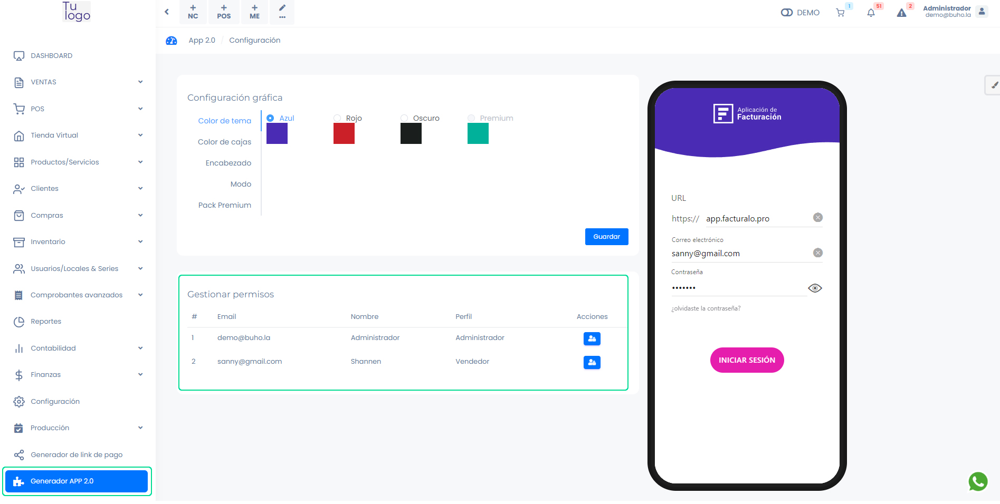
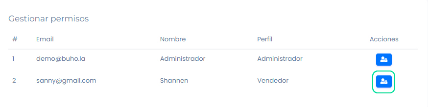

# Gestionar permisos

En este artículo te enseñaremos a gestionar los permisos para los usuarios. Sigue estos pasos para realizarlo:

Ingresa al módulo de **Generador APP 2.0**, se observará el área de Gestionar permisos.

## Gestionar permiso

Para gestionar permisos de cada usuario, selecciona el botón que se encuentra al lado derecho.

Seguido aparecerá la siguiente ventana emergente:

Selecciona todos los módulos que desea que el usuario acceda.

Selecciona el botón **Guardar**.

:::danger IMPORTANTE:

- El perfil de Administrador tiene todos los permisos asignados, no puede modificarlos.

:::
