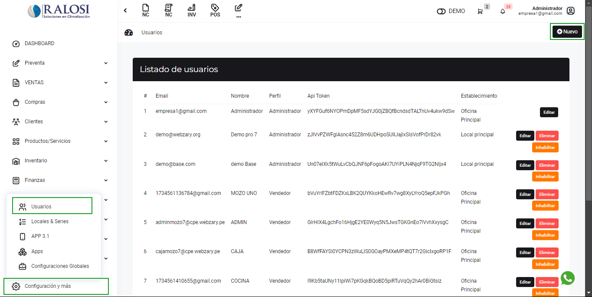
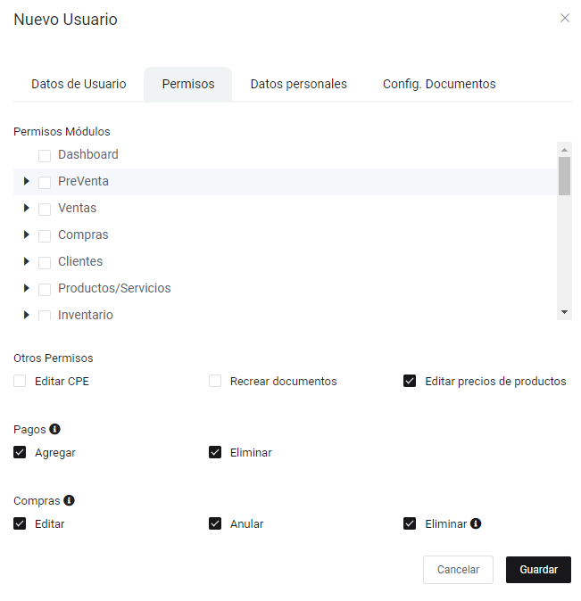
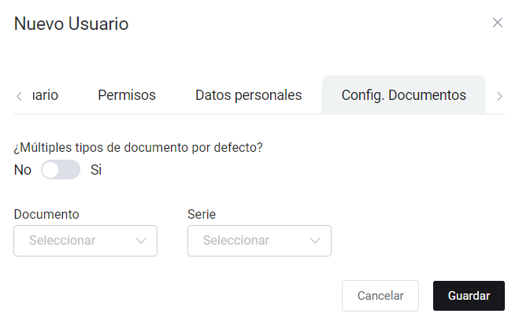
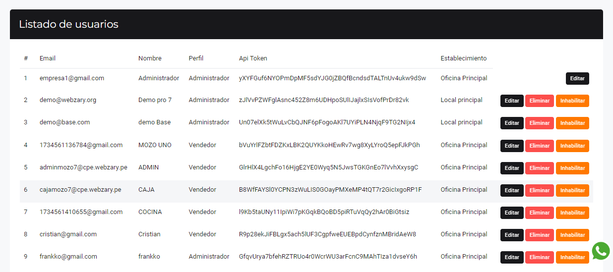

# Agregar usuarios a mi sistema

En esta área te ayudaremos a crear usuarios para que puedan ingresar al sistema. Sigue estos pasos para realizarlo:

Ingresa al módulo de **Configuración y más** luego selecciona la subcategoría **Usuarios**. En la parte superior derecha selecciona el botón **Nuevo**.

:::danger importante

Selecciona la opción recrear documentos si deseas permitir que tu usuario tenga la posibilidad de recrear un documento que aún este con el estado registrado.

:::

## Nuevo usuario

Aparecerá el formulario para llenar los datos del **Nuevo usuario**.

Se completarán los siguientes datos:

* **1. Nombre:** Ingresa el nombre del nuevo usuario.
* **2. Correo electrónico:** Ingresa el correo electrónico del usuario.
* **3. Establecimiento:**  Selecciona el establecimiento en el que el usuario estará asignado.
* **4. Contraseña:**  Crea una contraseña para el usuario.
* **5. Confirmar contraseña:**  Ingresa nuevamente la contraseña para confirmarla.
* **6. Perfil:**  Selecciona el perfil del usuario.

## Permisos

En esta sección se selecciona los módulos a los que tendrá acceso el usuario creado.

## Datos personales

En esta sección se completa con los datos personales del nuevo usuario. (Opcional)

## Config. Documentos

En esta sección se habilita al nuevo usuario que tipo de documentos va a poder emitir y las series especificas que desee que el usuario maneje. (Opcional)

Finalmente, una vez rellenado todos los datos selecciona el botón **Guardar**. Aparecerá la lista de usuarios creados.

:::danger importante

Una vez que creas un usuario, el correo de acceso ya no se puede cambiar. Si el usuario no ha hecho ningún tipo de movimiento, como compras o ventas, puedes eliminarlo. Pero, si ya tiene movimientos registrados, no te preocupes, ¡se puede inhabilitar!

Inhabilitar a un usuario es súper útil cuando ya no necesita acceder al sistema, pero no puedes eliminarlo porque tiene historial de transacciones. Así, el usuario no podrá acceder ni hacer nada, pero sus datos (como ventas o compras) seguirán guardados. Si más adelante necesita volver a acceder, lo puedes habilitar otra vez sin problemas.

:::
