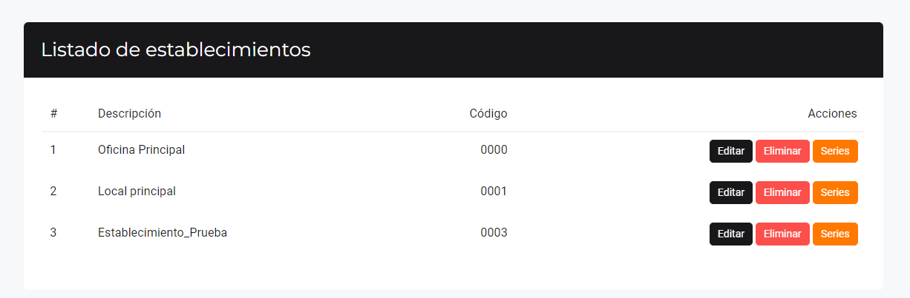

# Crear establecimientos y gestionar series

En esta área te ayudaremos a crear establecimientos o locales. Sigue estos pasos para realizarlo:

Ingresa al módulo de **Configuración y más** luego selecciona la subcategoría **Locales y series**.

## Nuevo establecimiento

En la parte superior derecha selecciona el botón **Nuevo**.

Aparecerá el formulario para llenar los datos del **Nuevo Establecimiento**.

* **1. Descripción:** Ingresa el nombre del establecimiento.
* **2. Código domicilio fiscal:** Ingresa el código del domicilio fiscal, se encuentra en tu ficha RUC.
* **3. País:** Selecciona el país.
* **4. Departamento:** Selecciona el departamento.
* **5. Provincia:** Selecciona la provincia.
* **6. Distrito:** Selecciona el distrito.
* **7. Dirección fiscal:** Ingresa la dirección fiscal.
* **8. Teléfono:** Ingresa el número de teléfono.
* **9. Dirección comercial:** Ingresa la dirección comercial del establecimiento.
* **10. Correo de contacto:** Ingresa el correo electrónico de contacto.
* **11. Dirección web:** Ingresa la dirección web si tuviera.
* **12. Información adicional:** Agrega alguna información adicional.
* **13. Cliente por defecto:** Agrega si hubiera algún cliente específico para el establecimiento.
* **14. Cambiar logo del establecimiento:** Selecciona para poder cambiar el logo de tu establecimiento.
* **15. Casilla de verificación:**
    * **Sujeto al IGV - Ley 31556:** Si perteneces al sector de restaurantes, hoteles y agencias de turismo, selecciona esta casilla para aplicar el IGV que te corresponde.
* **Dirección secundaria:** 

Esta opción se utiliza principalmente para generar guías de remisión con una dirección diferente a la que está asignada como principal. Es útil para manejar múltiples ubicaciones de despacho, almacenes temporales o cuando necesitas enviar mercancías desde una dirección distinta a la fiscal. 

## Listado de establecimientos

Hay podemos observar que hay tres botones:

* **Editar:** Se puede editar el establecimiento una vez creado.
* **Eliminar:** Elimina el establecimiento.

:::danger importante

No se puede eliminar un establecimiento cuando hay ventas o compras relacionadas.

:::

* **Series:** Se pueden editar las series de cada establecimiento.
