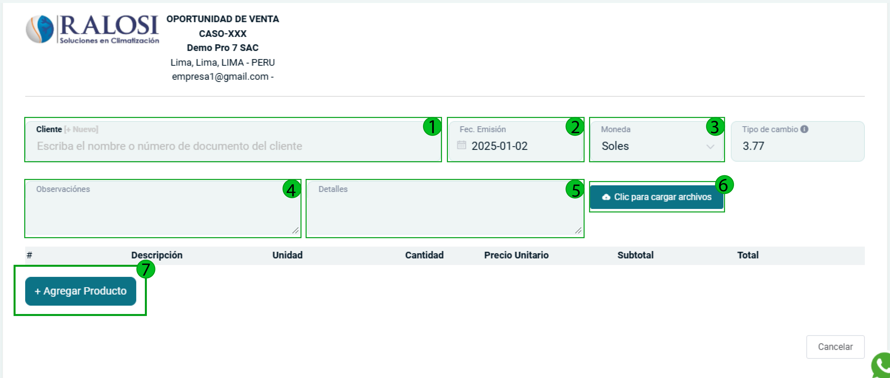
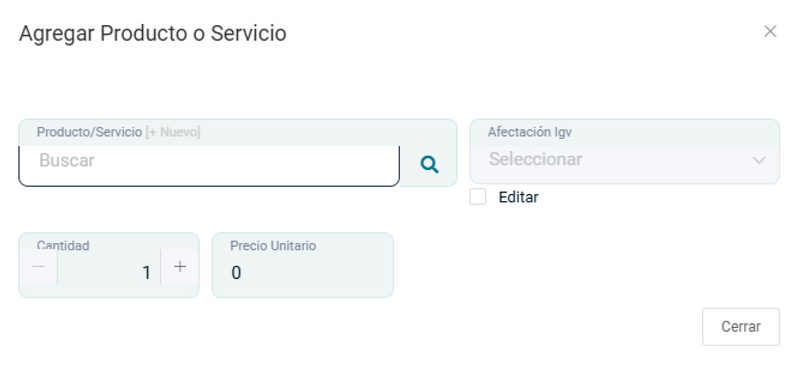
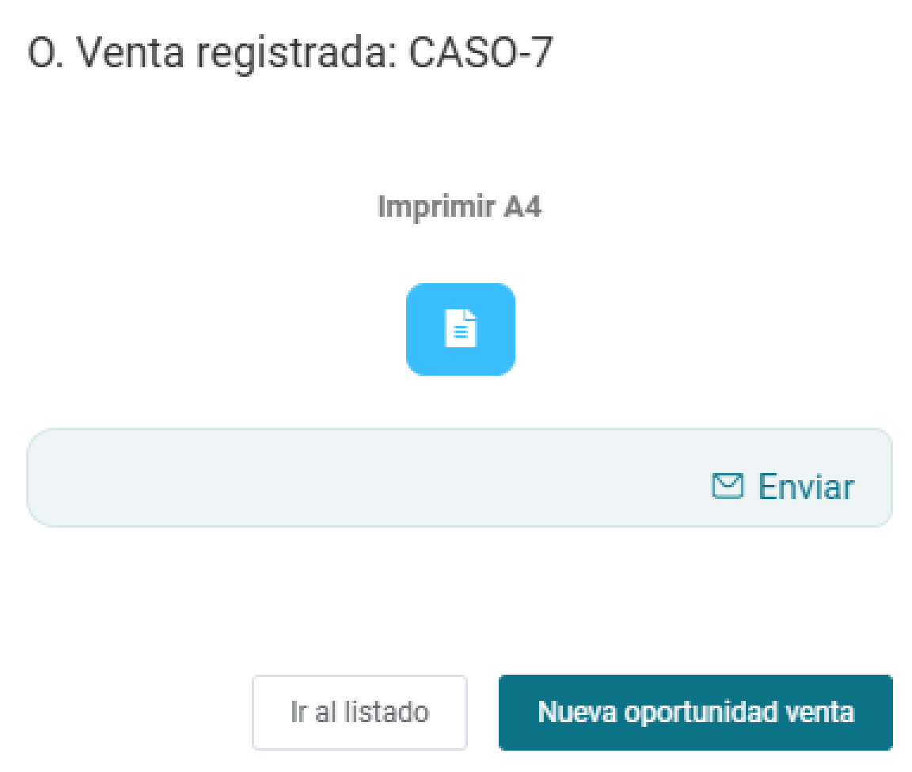
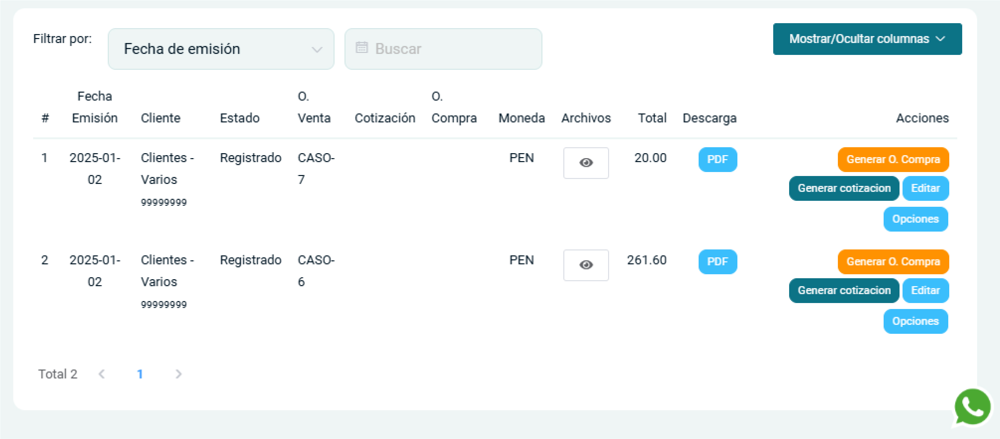
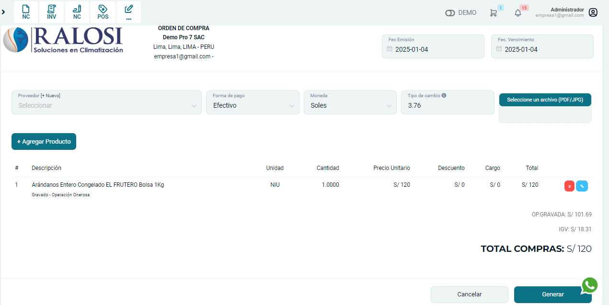
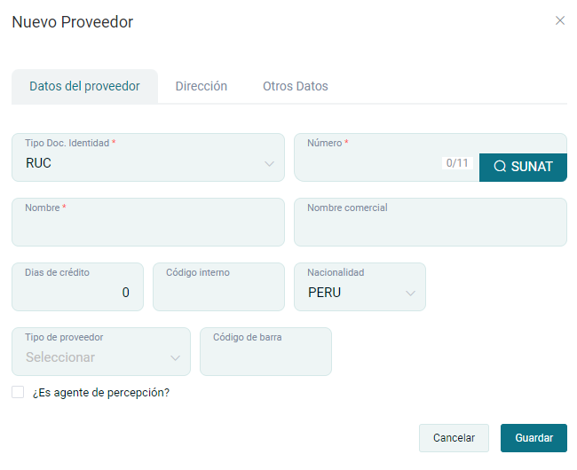
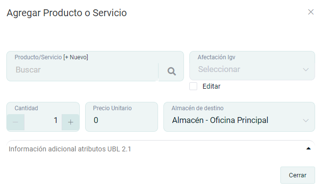
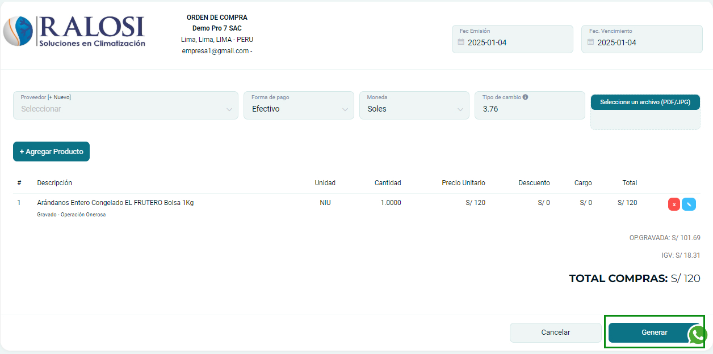
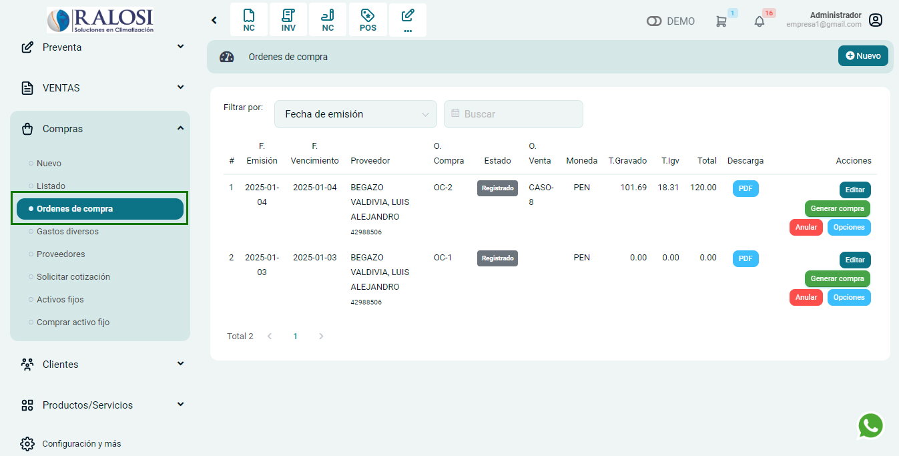

# Oportunidad de venta

Una oportunidad de venta es una posibilidad de cerrar un trato con un cliente potencial, que surge cuando este muestra interés en un producto o servicio y avanza en el proceso de compra. En una oportunidad de venta, se pueden incluir observaciones o detalles, así como cargar archivos si es necesario.

En esta área podrás generar una Oportunidad de Venta, que puede ser usada para proyectos que requieran el uso de imagenes.

Sigue estos pasos para realizarlo:

Ingresa al **módulo de Pre Venta** y luego selecciona la subcategoría **Oportunidad de venta**.

En la parte superior derecha selecciona el botón **Nuevo**.

## Crear oportunidad de venta

Al seleccionar el botón **Nuevo**, se encontrará el formulario de la oportunidad de venta.

Se completarán los siguientes datos:

- **Cliente:** Ingresa el cliente  para la creación de la oportunidad, si no está creado, podrá realizarlo paso a paso en este **[artículo](https://manual.uio.la/Pro7/modulos/Esenciales/clientes/Clientes-creacion-individual)**.
- **Fec. Emisión:** Es la fecha en la que se expide una factura.
- **Moneda:** Selecciona el tipo de moneda en dólares americanos o Soles
- **Observaciones:** Ingresa alguna observacion respecto a la oportunidad de venta
- **Detalles:** Ingresa algún detalle o carácterística del servicio/proyecto
- **Botón cargar archivos:** Ingresa algúna archivo o la imagen del producto.

Posteriormente selecciona el botón **Agregar producto** y encontrará el formulario de **Agregar producto o servicio**.

Se procederá a ingresar los siguientes datos:

- **Producto/Servicio:** Selecciona el producto creado previamente,si no está creado,podrá realizarlo paso a paso,en este **[artículo](https://manual.uio.la/Pro7/modulos/Esenciales/productos-servicios/Productos-Creacion-basica)**.
- **Cantidad:** Ingresa la cantidad de producto/servicio
- **Precio unitario:** Deberá colocar el valor de su producto/servicio.

Después selecciona el botón **Agregar**, donde visualizará la descripción del servicio/producto. Asimismo, completados estos pasos, procede a seleccionar el boton **Generar** y se creará la oportunidad de venta.

Por consiguiente, aparecerá una ventana de la **oportunidad registrada**, donde tendrá la opción de imprimirla en formato A4 ,además también puedes seleccionar los botones de **Ir a listado** y **crear nueva oportunidad de venta**.

## Lista de oportunidades de ventas

Al seleccionar el botón **Ir al listado**,se observará la lista de las oportunidades que se crearon.

Contaremos con las siguientes opciones o botones:

- **Archivos:** Se visualizará la imagen/archivo del producto
- **Descarga:** Permite la descarga en PDF.
- **Generar O.Compra:** Permite generar la orden de compra de nuestros proveedores.
- **Generar Cotización:** Permite generar la cotización del proyecto. Te invitamos a leer nuestro **[artículo](https://manual.uio.la/Pro7/modulos/Esenciales/Preventa/Cotizaciones)** ,donde te explicaremos paso a paso, la creación de una cotización.
- **Editar:** Permite la edición del formulario de la oportunidad de venta
- **Opciones:** Permite imprimir la oportunidad en formato A4.

## Generar orden de compra

En esta sección te enseñaremos a detalle la funcionalidad del botón de Generar orden de compra, para ello selecciona el botón y se encontrará el siguiente formulario.

Se procederá a ingresar los siguientes datos:

- **Proveedor:** Ingresa el proveedor para la creación de la orden de compra, caso contrario deberá crearlo seleccionando el botón **[+Nuevo]**.

    Se encontrará  el formulario nuevo proveedor, con los campos:

    - **Tipo Doc.Identidad:** Seleccione RUC,DNI,CE,etc.

    - **Número:** Ingrese el número que corresponde al  tipo de documento Identidad.

    - **Nombre:** Se autocompletará el nombre que corresponde al  tipo de documento Identidad.

La sección de **dirección y otros datos** deberá completarlos según el requerimiento de su empresa.

Después selecciona el botón **GUARDAR**.

- **Fec Emisión:** Es la fecha en la que se expide una factura.
- **Fec Vencimiento:** Es la fecha límite de pago de una factura que un proveedor y su cliente pactan antes de la prestación del servicio.
- **Moneda:** Selecciona el tipo de moneda en dólares americanos o Soles
- **Forma de Pago:** Selecciona el tipo de pago conveniente
- **Botón seleccionar archivo:** Permite añadir un archivo en PDF/JPG

Posteriormente selecciona el botón **Agregar producto** y encontrará el formulario de **Agregar producto o servicio**.

Después selecciona el botón **Agregar**, donde visualizará la descripción del servicio/producto. Asimismo completado estos pasos, procede a seleccionar el boton **Generar** y se creará la orden de compra.

Por consiguiente, se habrá **creado la orden de compra**, y  finalmente nos redirigirá a la lista de ordenes de compras generadas, ubicado dentro del módulo compras y subcategoría ordenes de compras.

