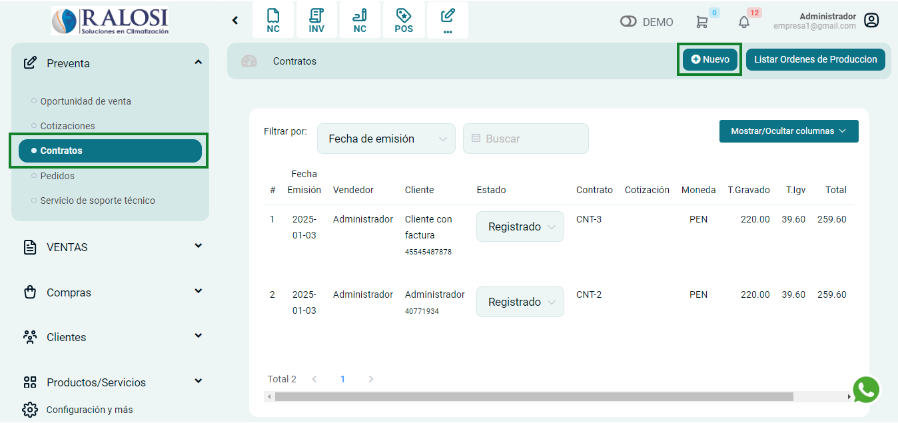
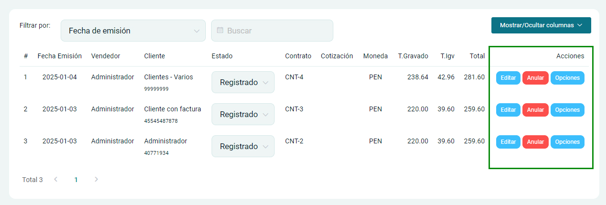
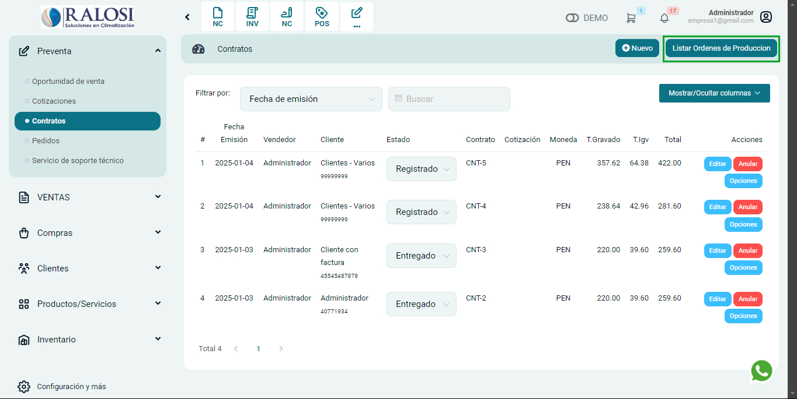

# Contratos

Los contratos son acuerdos vinculantes que establecen los términos para ambas partes involucradas, donde se definen aspectos como los precios de los productos, los terminos de pago, y otros detalles relevantes en una transacción o acuerdo de compra. Podrá cambiar el estado de

En esta área podrás generar contratos, Sigue estos pasos para realizarlo:
Ingresa al **módulo de Pre Venta** y luego selecciona la subcategoría desplegable **contratos**,donde estará la sección Listado y órdenes de Producción.

## Listado

En esta sección veremos la lista de contratos creados, para crear uno nuevo selecciona el botón **Nuevo**.

Se encontrará el formulario de contrato y se completarán los siguientes datos:

**Datos del cliente**
Se deben añadir los siguientes campos:

- **1. Cliente:** Ingresa el cliente  para la creación de la oportunidad.
- **2. Fec. Emisión:** Es la fecha en la que se expide un contrato.
- **3. Fec. Vencimiento:** Es la fecha en la que se culmina un contrato.
- **4. Fec. Entrega:** Es la fecha en la que se entrega el servicio/producto.
- **5. Término de pago:** Selecciona la opción que más se amolde a sus requerimientos
- **6. Moneda:** Selecciona el tipo de moneda en dólares americanos o Soles
- **7. Tipo de cambio:** Indica el tipo de cambio aplicable.

**8. Agregar producto:**
Posteriormente selecciona el botón **Agregar producto** y encontrará el formulario de **Agregar producto o servicio**.

Se procederá a ingresar los siguientes datos:

- **Producto/Servicio:** Selecciona el producto creado previamente,si no está creado,seleccione NUEVO.
- **Cantidad:** Ingresa la cantidad de producto/servicio
- **Precio unitario:** Deberá colocar el valor de su producto/servicio.

Después selecciona el botón **Agregar**, donde visualizará la descripción del servicio/producto.

**9. Informacion adicional**
Campos de informacion adicionales:

- **Vendedor:** Nombre del vendedor
- **Descripción:** Añada alguna descripción o carácterística del servicio/producto.
- **Número de cuenta:** Añada el número de cuenta donde se realizarán los depósitos bancarios.
- **Dirección de envío:** Coloca la dirección del destinatario.

**Métodos de pago:**
Se deben añadir los siguientes campos:

- **Método de pago:** Selecciona la opción que más se amolde a sus requerimientos
- **Destino:** Ubicación donde ingresará el dinero.
- **Referencia:** Campo de texto, podría colocar el # operación de la transferencia.
- **Monto:** Cantidad de pago.
- **[+Agregar]:** Puede añadir otros métodos de pago.

Asimismo, completados estos pasos, procede a seleccionar el boton **Generar** y se creará el contrato.

Por consiguiente, aparecerá una ventana de la **Contrato registrado**, donde tendrá la opción de imprimir o descargar en formato A4.

Finalmente para observar la lista de contratos creados, no ubicamos nuevamente en **listado**.

Contaremos con las siguientes opciones o botones:

- **Estado:** Permite seleccionar si está entregado/rechazado/registrado
- **Editar:** Se podrá editar el contenido del contrato
- **Anular:** Se eliminará el contrato
- **Opciones:** Permite imprimir o descargar la oportunidad en formato A4.

## Órdenes de producción

Para listar las ordenas de produccion, seleccione el boton **Listar Ordenes de Produccion**

En esta sección se visualizarán todos los contratos que tengan una fecha estimada de entrega.

