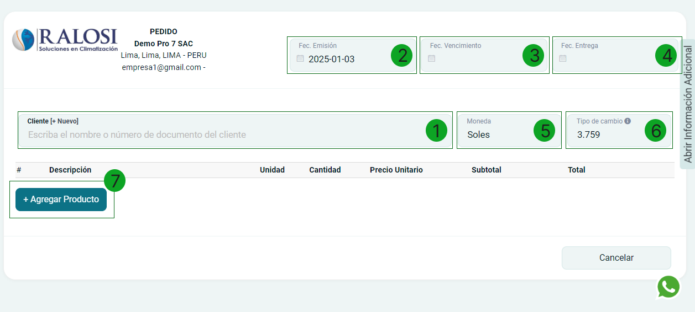
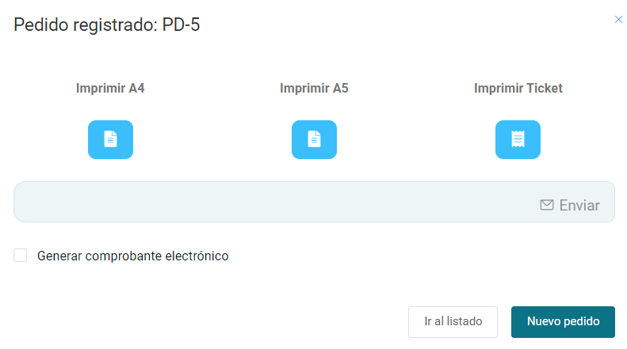
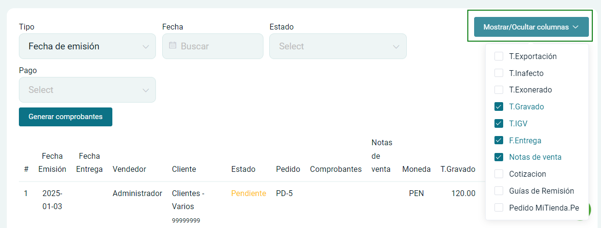
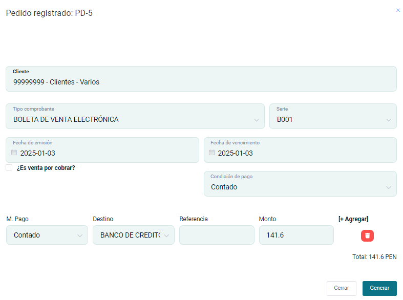

# Pedidos

En esta área podrás generar pedidos de venta. Sigue estos pasos para realizarlo:

Ingresa al **módulo de Pre Venta** y luego selecciona la subcategoría **Pedidos**.En la parte superior derecha selecciona el botón **Nuevo**.

## Generar pedidos

En esta sección podrá empezar con la creación de su formulario de pedido.

Se encontrará el formulario del tipo de comprobante y se completarán los siguientes datos:

1. **Cliente:** Luego deberá escoger el cliente para la creación del comprobante, si no está creado, podrá realizarlo paso a paso en este **[artículo](https://manual.uio.la/Pro7/modulos/Esenciales/clientes/Clientes-creacion-individual)**.

2. **Fec.Emisión:** Colocar la fecha en la que se realiza el pedido.

3. **Fec.Vencimiento:** Colocar fecha de vencimiento.

4. **Fec.Entrega:** Colocar la fecha en la que se entregará el pedido.

5. **Moneda:** Podrá seleccionar si desea el pago en dólares o soles.

6. **Tipo de cambio:** El tipo de cambio varía según la SUNAT.

7. **Agregar producto:** Luego deberá escoger el producto para la creación de la cotización, si no está creado, podrá realizarlo paso a paso en este **[artículo](https://manual.uio.la/Pro7/modulos/Esenciales/productos-servicios/Productos-Creacion-basica)**.

Después selecciona el botón **Generar** y aparecerá una ventana,indicando que la cotización ha sido aceptada.

Además podrás escoger el formato de la cotización en tamaño **A4(vertical), 80MM (ticket) y A5(horizontal)**.
Asimismo puedes enviarlo por correo electrónico o WhatsApp, ingresando el dato del destinatario y seleccionando el botón **Enviar.**

Finalmente puedes seleccionar el botón  ir al **listado**, donde visualizará los pedidos generados,  o proceder a un nuevo pedido.

## Listado de pedidos

**1. Filtros de búsqueda**
En esta área podrá buscar una cotización específica.

**Filtrar por:** Para encontrar una ficha de servicio técnico de una manera más rápida puede filtrar la búsqueda con los siguientes datos.

- **Fecha de emisión**
- **Fecha de entrega**
- **Vendedor**

**Buscar:**En esta área escribimos el nombre del dato que seleccionamos en la anterior casilla.

**2. Generar comprobantes**
Al seleccionar este botón aparecerá una ventana donde podrá elegir las que con las que desee generar comprobantes, de manera masiva.Estos comprobantes se generarán de manera independiente.

:::danger IMPORTANTE:
De esta manera no se pueden agregar pagos a diferencia de generar el comprobante de manera individual.
:::

**3. Mostrar/Ocultar columnas**
En esta área podrás modificar la tabla que te aparece por defecto; se pueden añadir por columnas.

**4. PDF**
Al seleccionar se descarga el archivo **PDF** de la ficha de servicio técnico.

**5. Botones de Acción**
Se encontrará una sección de botones, con las siguientes funciones:

- **Generar comprobante:** Genera  un comprobante electrónico (Factura o Boleta).
Al seleccionar  aparecerá un formulario para generar un comprobante de pago.Los campos se autocompleta con los datos ya ingresados.

- **Editar:** Podrá editar el comprobante de pedido.
- **Anular:** Podrá anular el comprobante de pedido.
- **Duplicar:** Podrá duplicar el comprobante de pedido
- **Guía:** Genera una guía.
