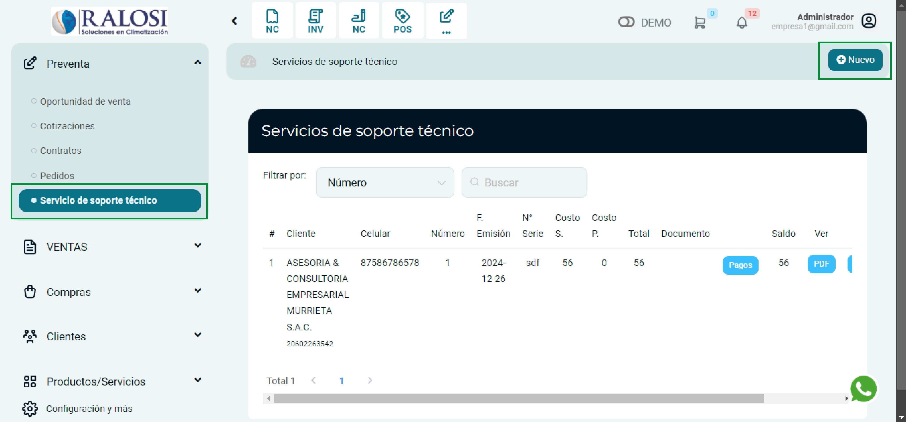
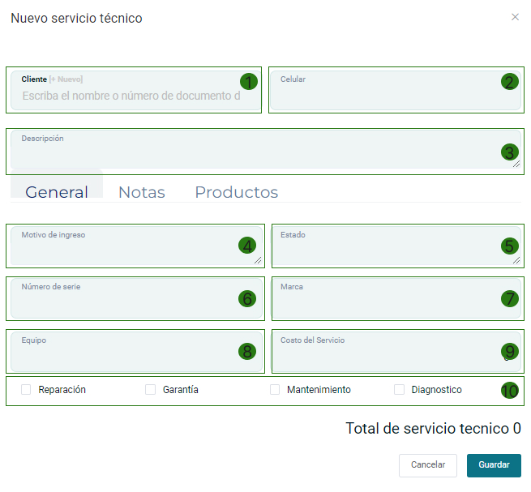
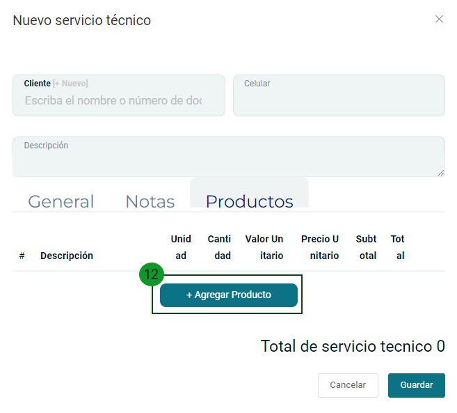
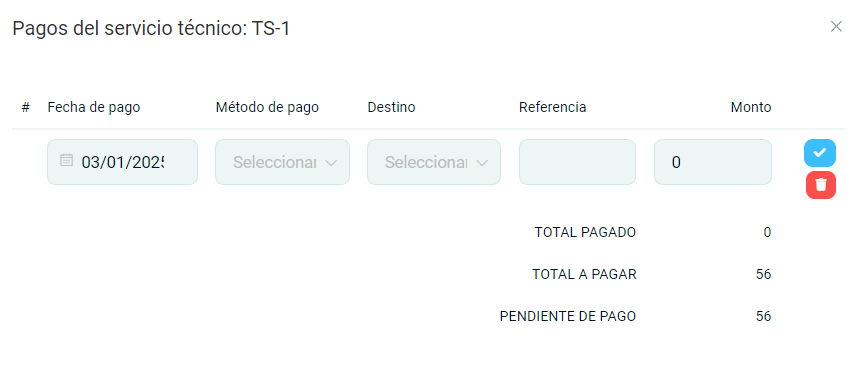

# Servicio de soporte técnico

En esta área podrás generar fichas de soporte técnico.

Sigue estos pasos para realizarlo:

Ingresa al **módulo de Pre Venta** y luego selecciona la subcategoría **Servicio de soporte técnico**.

En la parte superior derecha selecciona el botón Nuevo.

## Generar ficha de soporte técnico

En esta sección podrá empezar con la creación de la ficha de soporte técnico y realizar otras importantes configuraciones.

Se encontrará el formulario del tipo de comprobante y se completarán los siguientes datos:

**1. Cliente:** Deberá escoger el cliente para la creación del comprobante, si no está creado, podrá realizarlo paso a paso en este **[artículo](https://manual.uio.la/Pro7/modulos/Esenciales/clientes/Clientes-creacion-individual)**.

**2. Celular:** Ingrese el número de teléfono del cliente.

**3. Descripción:** Ingrese una breve descripción del servicio que realizará.

**4. Motivo de ingreso:** Ingrese una breve descripción sobre los daños que presenta el equipo.

**5. Estado:** Ingrese el estado del equipo.

**6. Número de serie:** Ingrese el número de serie del equipo.

**7. Marca:** Ingrese la marca del equipo al que se realizará el servicio.

**8. Equipo:** Ingrese el tipo de  equipo al que se realizará el servicio

**9. Costo del servicio:** Ingrese el monto que cobrará por realizar el servicio.

**10. Casilla de selección:** Más opciones para seleccionar que ayudará a especificar el servicio de soporte técnico:

- **Reparación**

- **Garantía**

- **Mantenimiento**

- **Diagnóstico**

**11. Notas:** Si desea agregar una nota adicional seleccione el botón **[+Agregar]**.

**12. Agregar Producto:**

En el caso de que además del servicio, s e este vendiendo un producto, puede añadirlo en esta pestaña.

Posteriormente seleccione el botón **Guardar**.

Posteriormente le redirigirá a la lista de Servicios de soporte técnico.

Lista de Servicios de soporte técnico.

**1. Filtros de búsqueda**

En esta área podrá buscar una ficha de servicio técnico específica.

**Filtrar por:** En esta sección encontrará la ficha de servicio técnico de una forma más rápida y puede filtrar la búsqueda con los siguientes datos:

- **Número**
- **Cliente**
- **Fecha de emisión**

**2. Pagos**

Al seleccionar aparecerá una ventana para añadir un pago a la ficha de servicio técnico realizada.

**3. PDF**

Al seleccionar se descarga el archivo **PDF** de la ficha de servicio técnico.

**4. Botones de Acción**

Se encontrará una sección de botones, con las siguientes funciones:

- Generar comprobante: Permite generar los comprobantes electrónicos.
Al seleccionarlo, aparecerá el formulario **servicio de soporte técnico** para generar el comprobante de pago. Los campos se autocompletarán con los datos ya ingresados.

- **Editar:** Podrá editar la ficha de servicio técnico.
- **Eliminar:** Podrá eliminar la ficha de servicio técnico.
