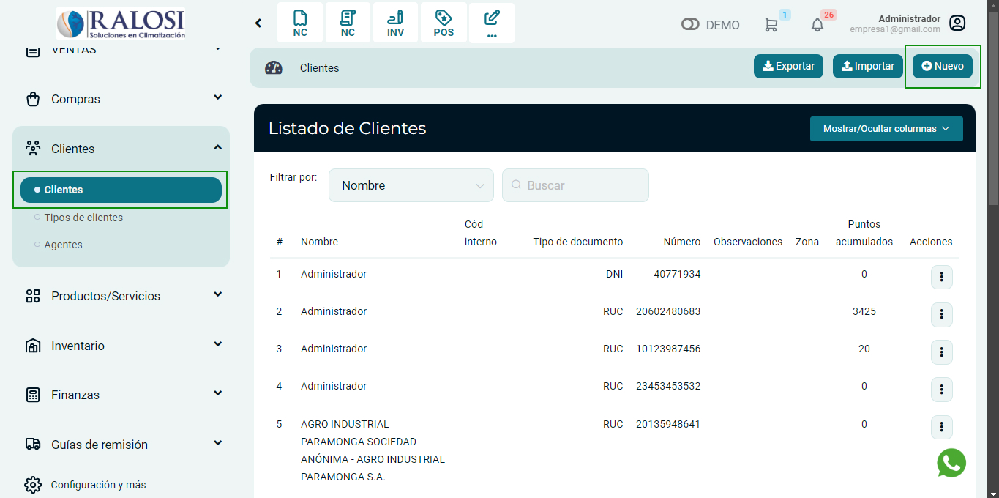
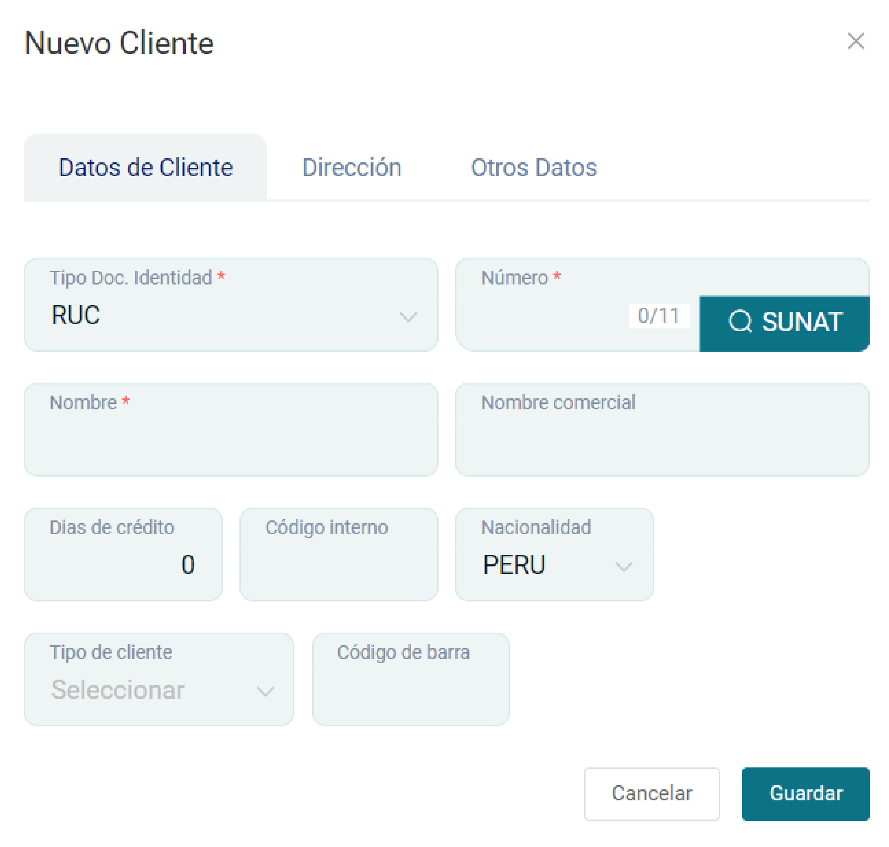
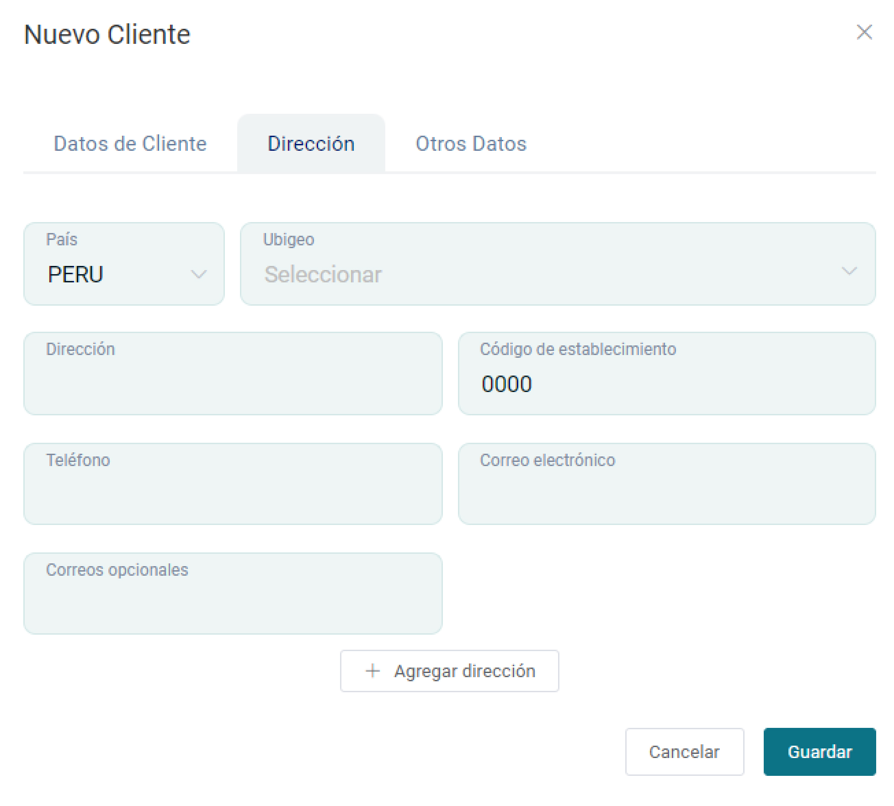

# Creación Individual

En esta área te ayudaremos a cómo crear clientes de forma individual. Sigue estos pasos para realizarlo:

## Crear nuevo cliente

Ingresa al módulo de **Clientes** y luego selecciona subcategoría **Clientes.**

En la parte superior derecha selecciona el botón **Nuevo.**

## Datos de cliente

Posteriormente aparecerá el formulario para llenar los datos del **Nuevo Cliente.**

Se completarán los siguientes datos:

* **Tipo Doc Identidad:** Selecciona RUC,DNI,CE,etc.
* **Número:** Ingresa el número que corresponde al  tipo de documento Identidad. Después selecciona el botón SUNAT, para que se autocomplete el nombre y la dirección.
* **Nombre:** Se autocompletará el nombre que corresponde al  tipo de documento Identidad.
* **Nombre comercial:** Ingresa la denominación que identifica a la empresa.
* **Días de crédito**
* **Código Interno:** Ingresa el código del cliente.
* **Tipo de cliente:** Ingresa la clasificación de su cliente, para conocer cómo crearlo, te invitamos a leer nuestro **[artículo](https://manual.uio.la/Pro7/modulos/Esenciales/clientes/Configurar-tipos-de-clientes)**.
* **Código de barra:** Ingresa el código de barra del cliente.

:::info IMPORTANTE:
Tener en cuenta los siguientes puntos: [artículo](https://manual.uio.la/Pro7/guias-adicionales/Consulta-Api)

:::

## Dirección

Se completarán los siguientes datos:

* **Nacionalidad:** Ingresa la nacionalidad.
* **País:** Ingresa el país.
* **Departamento:** Ingresa el departamento.
* **Provincia:** Ingresa la provincia.
* **Distrito:** Ingresa el distrito.
* **Dirección:** Ingresa dirección domiciliaria.
* **Teléfono:** Ingresa teléfono de contacto.
* **Correo electrónico:** Ingresa el correo electrónico principal.

## Otros datos

En esta sección se colocarán los datos de el personal encargado, es opcional.

Se completarán los siguientes datos:

* **Nombre y Apellido:** Ingresa los datos personales.
* **Teléfono:** Ingresa número celular.
* **Sitio Web:** Ingresa página web.
* **Observaciones:** Ingresa detalle o especificaciones importantes.
* **Vendedor:** Ingresa el vendedor de la empresa.
* **Zona [+Nuevo]:** Ingresa la zona o puede agregar otro, seleccionando el botón **[+Nuevo]**.
Posteriormente selecciona el botón **Guardar** y se visualizará la lista de los clientes generados.
