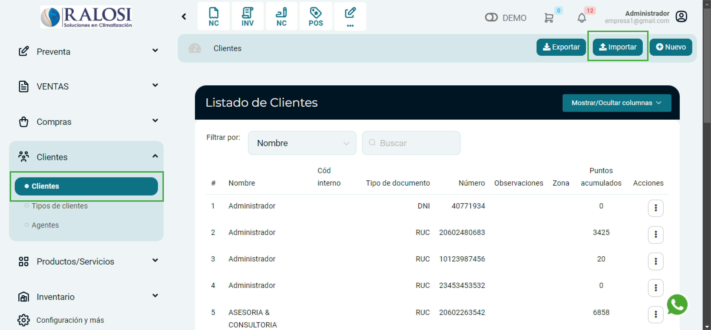
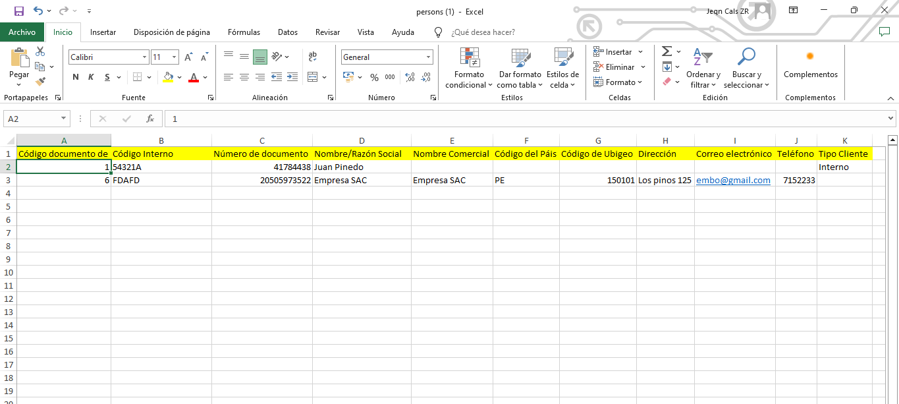

# Importación Masiva

En esta artículo te ayudaremos a crear **clientes de manera masiva**. Sigue estos pasos para realizarlo:

Ingresa al **módulo de Clientes** y luego selecciona subcategoría **Clientes**.En la parte superior derecha selecciona el botón **Importar.**

Posteriormente aparecerá una ventana de **Importar Clientes.** Selecciona **Descargar formato.**

Descargará un archivo en formato excel.

En este archivo complete los siguientes campos:

1. **Código documento de identidad:** Ingresa el código según corresponda.
    * 1 para DNI
    * 4 para Carnet de extranjería
    * 6 para RUC
    * 7 para PASAPORTE

2.  **Número de documento (*):** Ingresa su número de DNI, CARNET DE EXTRANJERÍA, RUC o PASAPORTE.
3.  **Nombre/Razón Social (*):**  Ingresa el nombre de la persona o la empresa.
4.  **Nombre Comercial:** Ingresa el nombre comercial de la empresa.
5.  **Código del País (*):** Ingresa el código del país.
6. **Código de Ubigeo (*):** Ingresa el código de ubigeo.

:::info DATO
 Puede buscar el código de ubigeo aquí:**[https://portal.mtc.gob.pe/comunicaciones/autorizaciones/radiodifusion/documentos/1/CODIGOS%20DE%20AREA%20-%20PERU.pdf](https://portal.mtc.gob.pe/comunicaciones/autorizaciones/radiodifusion/documentos/1/CODIGOS%20DE%20AREA%20-%20PERU.pdf)**

:::

7. **Dirección (*):** Ingresa la dirección del cliente.
8. **Correo electrónico:** Ingresa el correo electrónico del cliente.
9. **Tipo de Cliente:** Ingresa el tipo de cliente.

:::danger IMPORTANTE:

* El tipo de cliente a ingresar debe tener en cuenta que en el sistema tiene que estar previamente agregados.
* Todos los campos que cuentan con **(*)** son obligatorios.

:::

Una vez rellenado el archivo excel, deberá seleccionar el botón **Seleccione un archivo (xlsx)**, para subir el archivo correspondiente.

Finalmente selecciona el botón **Procesar**, se observará el **Listado de Clientes**, donde podrá visualizar sus principales caraterísticas.
