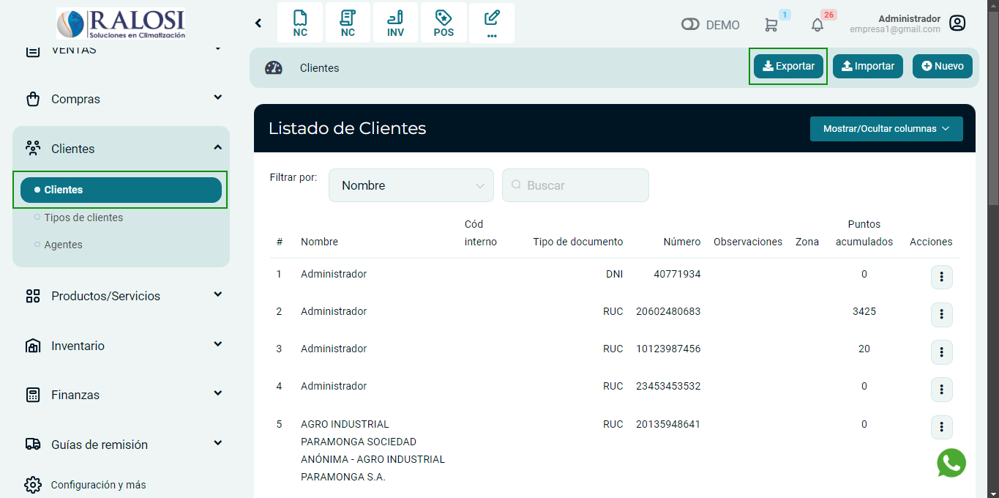
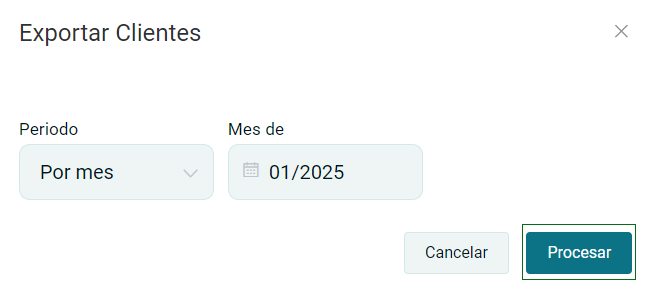

# Clientes Exportar
En esta artículo te ayudaremos a **exportar clientes**. Sigue estos pasos para realizarlo:

Ingresa al **módulo de Clientes** y luego selecciona subcategoría **Clientes**.En la parte superior derecha selecciona el botón **Exportar.**

Te aparecera una ventana para exportar el cliente.Eliga su periodo de conveniencia y precione **Procesar**.

Esto descargara un archivo **Exel**, con los clientes de su sistema.