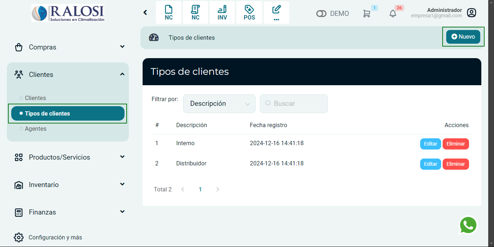
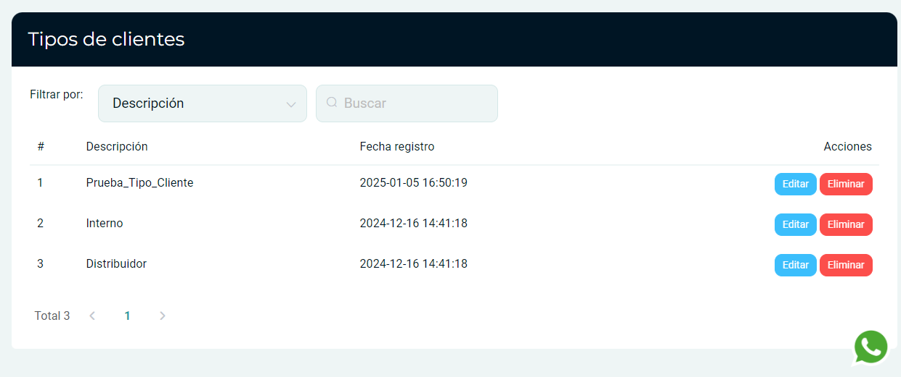

# Tipos de clientes

En este artículo podrás conocer cómo crear **Tipos de clientes.** Sigue estos pasos para realizarlo:

Ingresa al módulo de **Clientes** y luego selecciona subcategoría **Tipos de clientes.** Para añadir un tipo de cliente selecciona en el botón **Nuevo.**

Posteriormente aparecerá una ventana de **Nuevo tipo de cliente.**

Ingresa el tipo de cliente que desee agregar, luego selecciona el botón **Guardar.**

Finalmente le aparecerá la lista de **Tipos de clientes creadas.**
