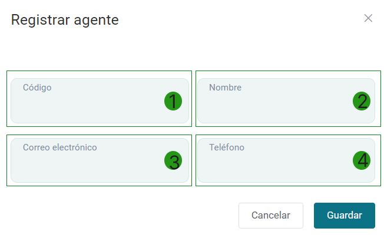
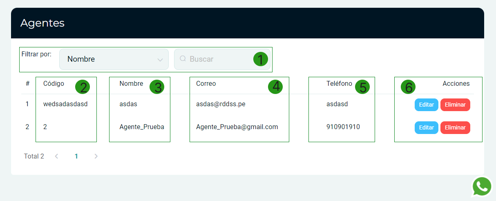

# Agentes  

En esta área, te mostraremos cómo gestionar los agentes dentro del sistema de manera efectiva. Sigue estos pasos para realizar acciones relacionadas con los agentes.  

## Acceder a Agentes  

Ingresa al módulo de **Clientes** y luego selecciona subcategoría **Agentes.**

En la parte superior derecha selecciona el botón **Nuevo.**

  

## Datos del agente  

Aparecerá un formulario para llenar los datos del **Nuevo Agente**.  

  

Completa los siguientes datos:  

* **1. Código**: Ingresa un código único para identificar al agente.  
* **2. Nombre**: Proporciona el nombre del agente.  
* **3. Correo electrónico**: Ingresa la dirección de correo electrónico del agente.  
* **4. Teléfono**: Proporciona el número de teléfono de contacto.  

Después de completar los datos, selecciona el botón **Guardar** para registrar al agente.  

## Visualizar agentes  

En la lista de agentes, podrás ver todos los registros existentes. La tabla incluye lo siguiente:  

  

| # | Código          | Nombre            | Correo                  | Teléfono    | Acciones                      |  
|---|-----------------|-------------------|-------------------------|-------------|-------------------------------|  
| 1 | wedsadasdasdsd  | asdas             | asdas@rddss.pe         | asdasd      | [Editar](#) | [Eliminar](#) |  
| 2 | 2               | Agente_Prueba     | Agente_Prueba@gmail.com | 910901910   | [Editar](#) | [Eliminar](#) |  

### Funciones disponibles:  

- **Filtrar por nombre**: Utiliza la barra de búsqueda para filtrar los agentes por su nombre.  
- **Editar**: Haz clic en el botón **Editar** para modificar la información del agente.  
- **Eliminar**: Selecciona **Eliminar** para borrar el registro del agente.  

Con estos pasos, podrás gestionar eficazmente la creación, visualización y modificación de agentes dentro del sistema. Esto facilita la organización y seguimiento de tus agentes de ventas o representantes.