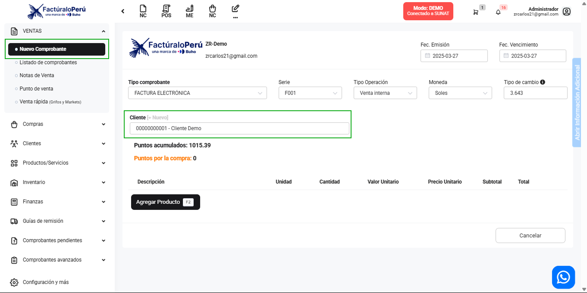

# ¿Cómo elegir un cliente por defecto?

En este apartado aprenderás a configurar un **cliente por defecto** para agilizar la creación de comprobantes en el módulo de Ventas. De esta manera, al generar un **Nuevo Comprobante**, el cliente configurado se cargará automáticamente.

---

## 1. Ir a "Sucursales y Series"

1. Desde el menú principal, dirígete a **Configuración y más**.  
2. Selecciona la subcategoría **Sucursales y Series**.

---

## 2. Crear o editar una sucursal

1. En la parte superior derecha, haz clic en **Nuevo** para crear una sucursal o en **Editar** para modificar una existente.

2. Se abrirá el modal de **Nueva Sucursal** o **Editar Sucursal**, donde deberás completar los campos obligatorios.

---

## 3. Configurar el "Cliente por defecto"

1. En el mismo modal, localiza la opción **Cliente por defecto**.
2. Selecciona el cliente que deseas que se cargue automáticamente en tus comprobantes.

> **Nota:** Asegúrate de que el cliente que quieres usar como defecto ya exista en el sistema.

---

## 4. Verificar en el módulo de Ventas

1. Dirígete al módulo **Ventas**.
2. Selecciona el submódulo **Nuevo Comprobante**.
3. Verás que el **cliente por defecto** elegido en la configuración de sucursales se cargará de manera automática.

---

## Conclusión

Con estos pasos, cada vez que crees un **Nuevo Comprobante** en el módulo de Ventas, se asignará el cliente por defecto que configuraste. Esto te permitirá agilizar el proceso de facturación y mantener la coherencia de datos en tu sistema.
