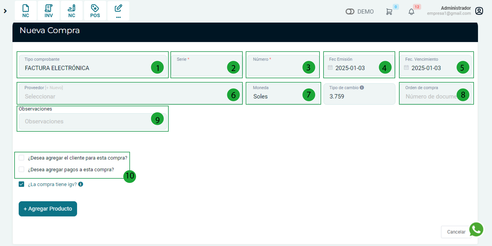
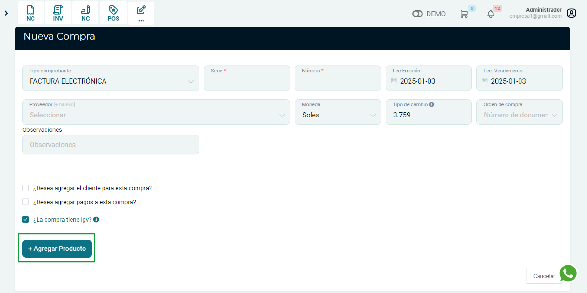

# Nueva compra

En esta artículo te ayudaremos a ingresar las compras realizadas. Sigue estos pasos para realizarlo:

Ingresa al **módulo de Compras** y luego selecciona la subcategoría **Nuevo**.

## Ingresar comprobante

En esta sección podrá ingresar el  comprobante que le dio su proveedor y realizar otras importantes configuraciones.

**1. Tipo de comprobante:** Selecciona el tipo de comprobante .

**2. Serie:** Ingresa la serie del comprobante.

**3. Número:** Ingresa el número del comprobante.

**4. Fec. Emisión:** Ingresa la fecha de emisión del comprobante.

**5. Fec. Vencimiento:** Ingresa la fecha de vencimiento del comprobante.

**6. Proveedor:** En esta sección escogerá el proveedor para ingresar en el comprobante, en caso no tenga registrado al proveedor deberá crearlo seleccionando el botón **[+Nuevo]**.

**7. Moneda:** Selecciona si el pago fue en dólares o soles

**8. Orden de compra:** En caso de tener orden de compra selecciónelo.

**9. Observaciones:** Alguna observación que desea añadir.

**10. Casillas de selección:**

- **¿Desea agregar el cliente para esta compra?:** Al seleccionar esta opción se agregar un campo de texto donde podrá seleccionar su cliente.
- **¿Desea agregar pagos a esta compra?:** Al seleccionar esta opción, detallaras las condiciones de pago del comprobante.

:::danger IMPORTANTE:

Todos los campos que cuentan con (*) son obligatorios.

:::

## Agregar Producto

Selecciona el botón **Agregar Producto**.

Se encontrará el formulario Agregar Producto o Servicio y se completarán los siguientes datos según el comprobante brindado por su proveedor:

**1. Producto/Servicio:** Selecciona un producto en caso el producto no este registrado, deberá crearlo seleccionando el botón [+Nuevo].

**2. Cantidad:** Ingresa la cantidad que esta ingresando a su negocio.

**3. Precio Unitario:** Ingresa el precio unitario del producto.

**4. Casillas de selección:**

- **Actualizar precio:** Si el producto antes no tenia precio de compra con esta casilla podrás actualizarla.
- **Editar precio de venta:** Podrá modificar el precio de venta del producto.
- **Asignar fecha de vencimiento:** Podrá ingresar la fecha de vencimiento del producto.

**5. Almacén de destino:** Selecciona a que almacén va dirigido tu producto.

**6. Información adicional atributos:** Ingresa si el producto le genero algún descuento, cargos o atributos.

Selecciona el botón **Agregar** para agregar el producto.

Una vez rellenado los campos, deberá selecciona el botón **Guardar**, asimismo podrá acceder a la Listado y observar todas sus compras realizadas.
