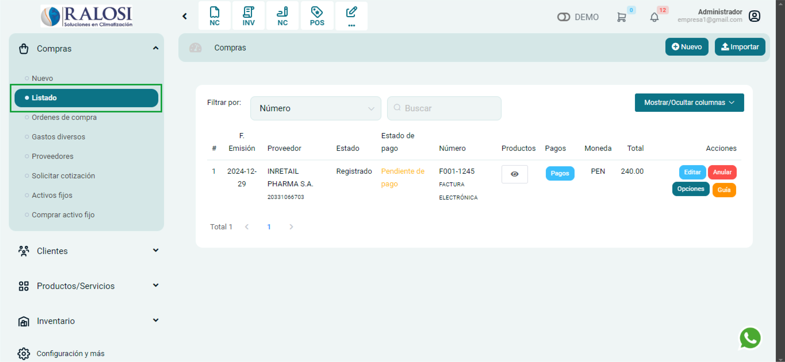
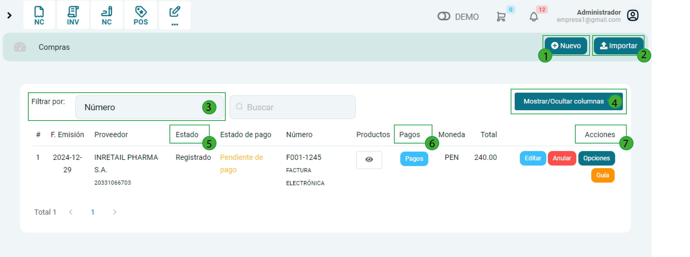
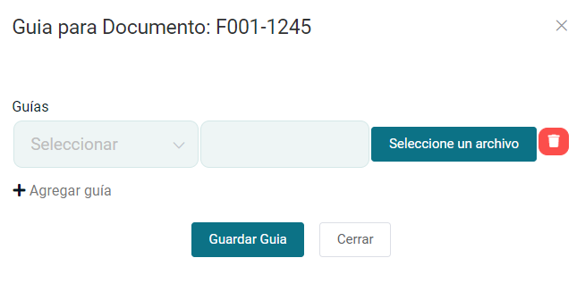

# Lista de compras

En este artículo podrás conocer cómo gestionar la lista de compras y otras funciones importantes. Sigue estos pasos para realizarlo:

Ingresa al módulo de **Compras** y luego selecciona subcategoría **Listado**.

## Listado de compras

Se visualizarán diferentes funcionalidades de las secciones enumeradas:

1. **Nuevo:** Permite crear una nueva compra, créelo paso a paso en este **[artículo](https://manual.uio.la/Pro7/modulos/Esenciales/compras/nueva-compra)**.

2. **Importar:** Permite importar comprobantes de compra.

3. **Filtrar por:** Para encontrar un comprobante de compra de una manera más rápida puede filtrar la búsqueda con los siguientes datos.

- **Número**
- **Fecha de emisión**
- **Fecha de pago**
- **Nombre proveedor**

4. **Mostrar/Ocultar columnas:** En esta área podrás modificar la tabla que te aparece por defecto; se pueden añadir por columnas.

5. **Estado:** En esta área se vera reflejada el estado del comprobante. Tiene dos estados:

- Registrado
- Anulado

6. **Pagos:** Al seleccionar este botón podrá observar el pago que realizo detalladamente.

7. Botones de acción:** Las funciones de los siguientes botones son:

- **Editar:** Podrá editar el comprobante electrónico.
- **Anular:** Podrá anular el comprobante electrónico.
- **Opciones:** Podrá volver a imprimir el comprobante electrónico.
- **Guía:** Podrá registrar la guía de remisión que le brindo su proveedor, también puede subir la guía de remisión. Seleccionando el botón Seleccione un archivo.

