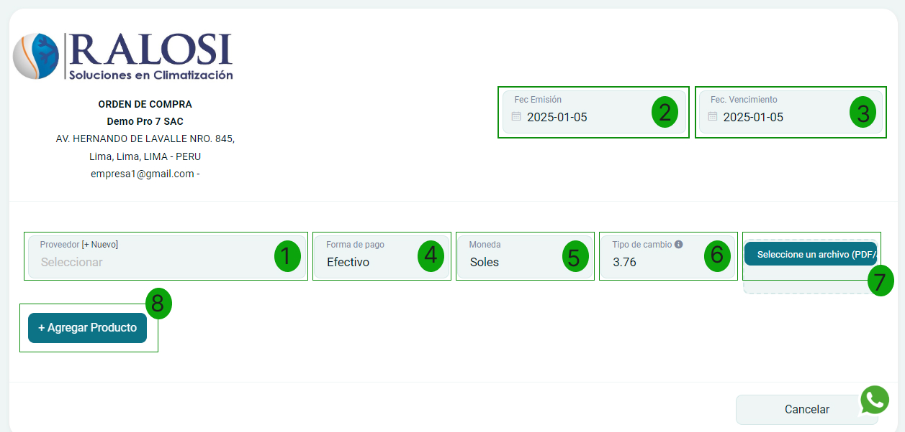
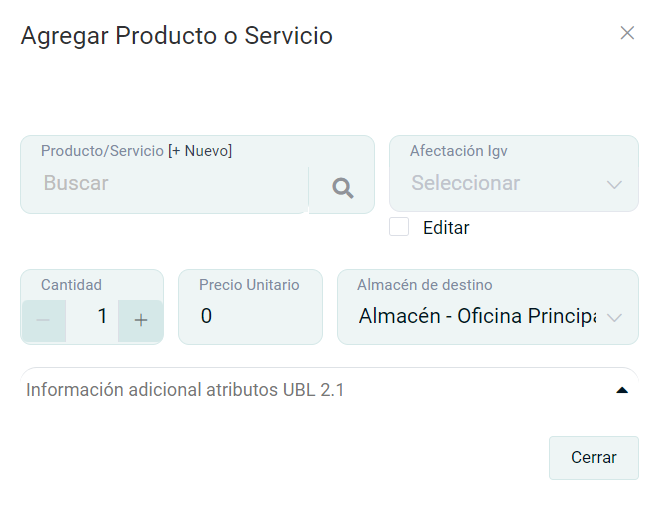
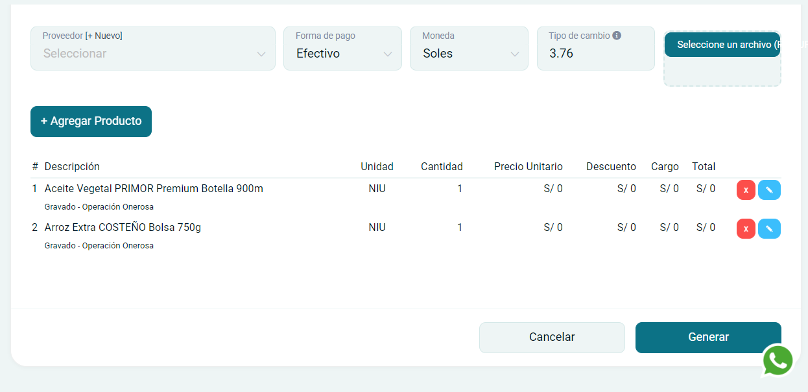
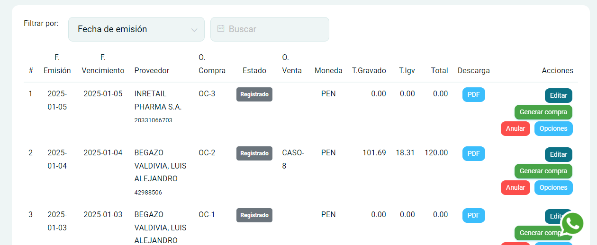

# Órdenes de compra

En esta área te ayudaremos a crear la solicitud de orden de compra. Sigue estos pasos:

Ingresa al módulo de **Compras** y luego selecciona la subcategoría **Órdenes de compra.**

## Crear orden de compra

Selecciona el botón **Nuevo** que está en la parte superior derecha de la página.

Se encontrará el formulario de la solicitud de orden compra y se completarán los siguientes datos.

## Orden de Compra  

### 1. Datos del proveedor  

- **Proveedor:** Ingresa el proveedor para la creación de la nueva compra. `[1]`  
- **Fec Emisión:** Es la fecha en la que se expide un documento. `[2]`  
- **Fec Vencimiento:** Es la fecha en la que se culmina un contrato. `[3]`  
- **Forma de pago:** Selecciona la opción que más se amolde a sus requerimientos. `[4]`  
- **Moneda:** Selecciona el tipo de moneda en dólares americanos o Soles. `[5]`  
- **Tipo de cambio:** Es el tipo de cambio del día, extraído de SUNAT. `[6]`  
- **Seleccione un archivo (PDF/JPG):** Selecciona un archivo que se adjuntará con la orden de compra. `[7]`  

### 2. Agregar producto  

Posteriormente, selecciona el botón **Agregar producto** para encontrar el formulario de **Agregar producto o servicio.** `[8]`

Se deben añadir los siguientes campos:

- **Producto/Servicio:** Selecciona el producto creado previamente,si no está creado, seleccione [+Nuevo].
- **Cantidad:** Ingresa la cantidad de producto/servicio.
- **Afectación Igv:** Por defecto se selecciona Gravado- Operación Onerosa en caso de que utilice un tipo de afectación de IGV distinto, puede seleccionarlo.
- **Precio unitario:** Deberá colocar el valor de su producto/servicio.
- **Almacén destino:** Es la ubicación del producto/servicio.

Después selecciona el botón **Agregar**, donde visualizará la descripción de la orden de compra.

Asimismo, completados estos pasos, proceda a seleccionar el botón **Generar** y se creará la orden de compra.

Por consiguiente, aparecerá una ventana de la orden de compra registrada, donde tendrá la opción de **imprimir** en formato A4, **ir al listado** o crear una nueva **Orden de compra**.

Finalmente para observar la **lista de órdenes de compra**, nos ubicamos nuevamente en listado.

Contaremos con las siguientes opciones o botones de acción:

- **Editar:** Permite editar la orden de compra.
- **Anular:** Permite anular la orden de compra.
- **Opciones:** Permite descargar en formato A4.
- **Generar Compra:** Cuando la orden de compra se confirma, se procederá a generar la compra, asimismo se creará un comprobante de pago.
Para aprender a crear una nueva compra, te invitamos a leer el siguiente **[artículo](https://manual.uio.la/Pro7/modulos/Esenciales/compras/nueva-compra)**.
