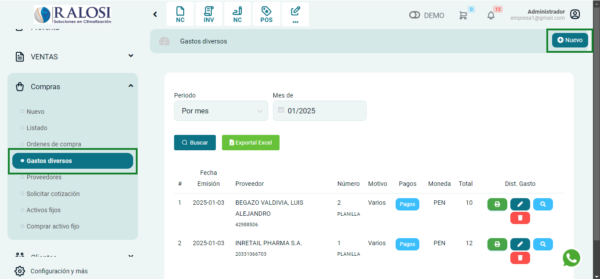
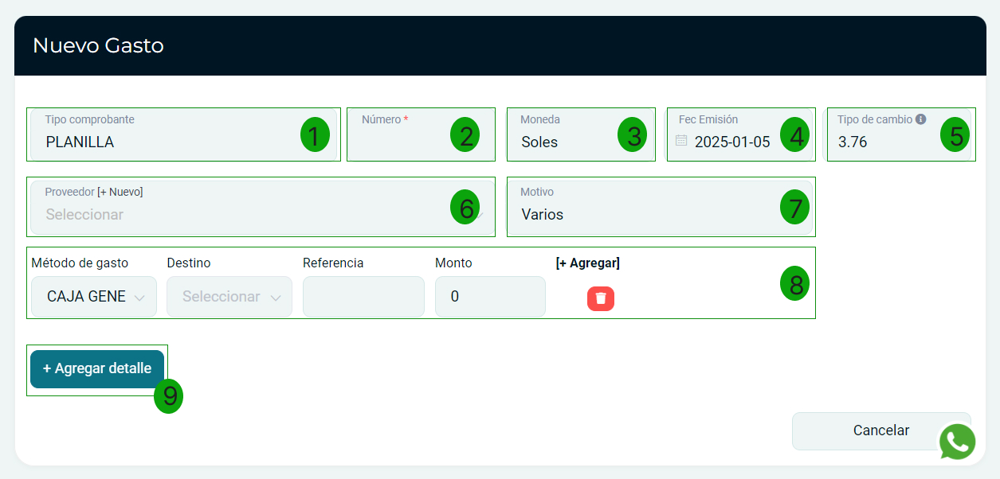
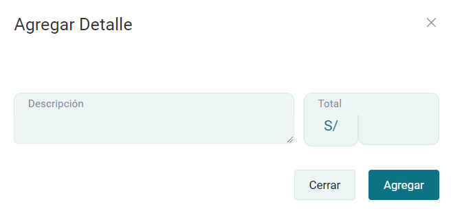

# Gastos diversos

En esta área te ayudaremos a ingresar tus gastos diversos. Sigue estos pasos para realizarlo:

Ingresa al módulo de **Compras** y luego selecciona la subcategoría **Gastos diversos**. En la parte superior derecha selecciona el botón **Nuevo**.

## Nuevo gasto

Visualizará el siguiente formulario, proceda a completar los siguientes campos.

**1. Tipo de comprobante:** Selecciona el tipo de comprobante o tipo de gasto.

**2. Número:** Ingresa el número del comprobante, de seleccionar OTROS no es necesario.

**3. Moneda:** Selecciona el tipo de moneda en la que se realizo la compra.

**4. Fec. Emisión:** Ingresa la fecha de emisión del comprobante.

**5. Tipo de cambio:** Este campo viene rellenado por defecto según los datos de la SUNAT.

**6. Proveedor:** Selecciona el proveedor para la creación del comprobante, si no está creado, podrá realizarlo paso a paso en este **[artículo](https://manual.uio.la/Pro7/modulos/Esenciales/compras/Proveedores-creacion-individual)**.

**7. Motivo:** Selecciona el motivo del nuevo gasto.

**8. Método de gasto:** Ingresa la información de donde proviene el dinero con el cual realizo el pago.

**9. Agregar detalle:** Selecciona el botón Agregar detalle. Aparecerá una ventada de Agregar detalle.

- **Descripción:** Ingresa la descripción.
- **Total:** Ingresa el monto total.

Luego presione el botón **Agregar**, observará los detalles añadidos en el comprobante.

Finalmente presione el botón **Generar**. Podrá dirigirse al listado, a una nueva compra o imprimir el comprobante.
