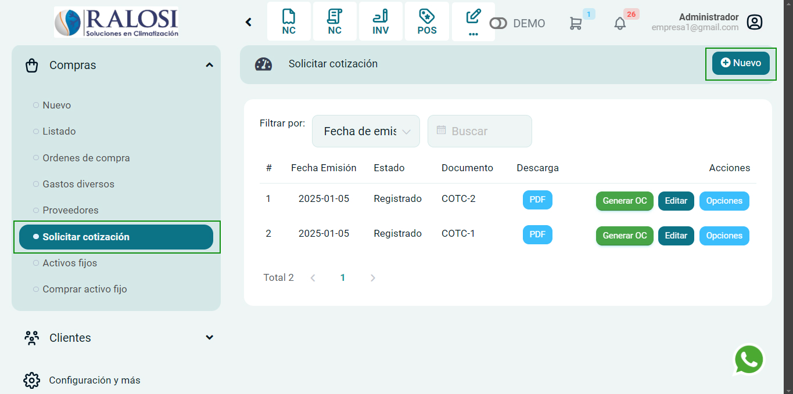
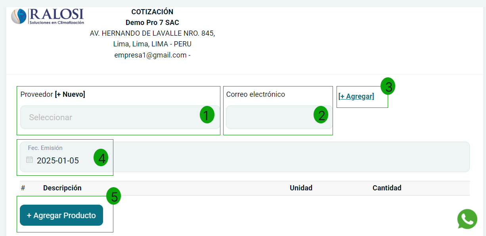
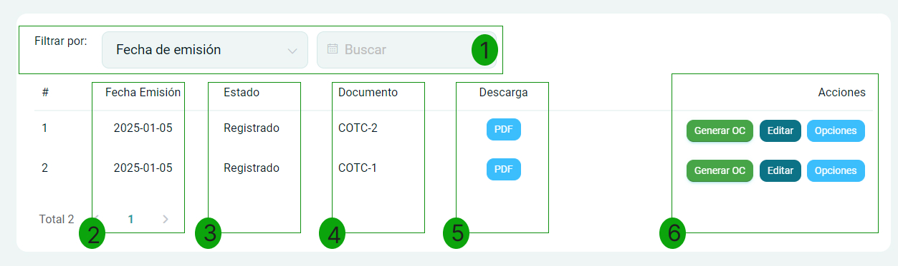

# Solicitar cotización

En esta área te ayudaremos a solicitar una cotización a tus proveedores. Sigue estos pasos para realizarlo:

Ingresa al módulo de **Compras** y luego selecciona **Proveedores** seguidamente la subcategoría **Solicitar cotización**. En la parte superior derecha selecciona el botón **Nuevo**.

## Generar cotización

Complete los siguientes campos:

1. **Proveedor:** Selecciona el proveedor para la creación del comprobante, si no está creado, podrá realizarlo paso a paso en este artículo.

2. **Correo electrónico:** Ingresa el correo electrónico.

3. **Botón agregar:** Al seleccionar este botón te crea un campo de campo adicional, para poder agregar un nuevo proveedor y correo electrónico.

4. **Fecha de emisión:** Ingresa la fecha de emisión del comprobante.

5. **Agregar producto:** Al seleccionar este botón se abrirá una ventana de **Agregar Producto o Servicio**. Agregue la cantidad a cotizar.

6. **Producto/Servicio:** Selecciona el producto o servicio, si no está creado, podrá realizarlo paso a paso en este **[artículo](https://manual.uio.la/Pro7/modulos/Esenciales/productos-servicios/Productos-Creacion-avanzada).**

Luego presione el botón **Agregar**, observará los productos añadidos en el comprobante.

Finalmente presione el botón **Generar**. Podrá imprimir el comprobante si así lo desea.
 
## Listado de Cotizaciones

### Filtrar por  

1. **Filtro de búsqueda:** Permite buscar por **Fecha de emisión**. Ingrese la fecha deseada para filtrar las cotizaciones.  

### Tabla de Cotizaciones    
  
- **Fecha Emisión:** Muestra la fecha en la que se emitió cada cotización. Esta información es clave para el seguimiento. `[2]`  
  
- **Estado:** Refleja el estado de la cotización, indicando si está **Registrado** u otro. `[3]`  
  
- **Documento:** Indica el número de documento asociado a la cotización, como **COTC-1** o **COTC-2**. `[4]`  
  
- **Descarga:** Proporciona una opción de descarga en formato **PDF** para cada cotización. `[5]`  

### Acciones  `[5]` 

- **Generar OC:** Permite generar una orden de compra a partir de la cotización seleccionada.  
- **Editar:** Opción para editar la cotización si es necesario.  
- **Opciones:** Ofrece opciones adicionales para gestionar la cotización.